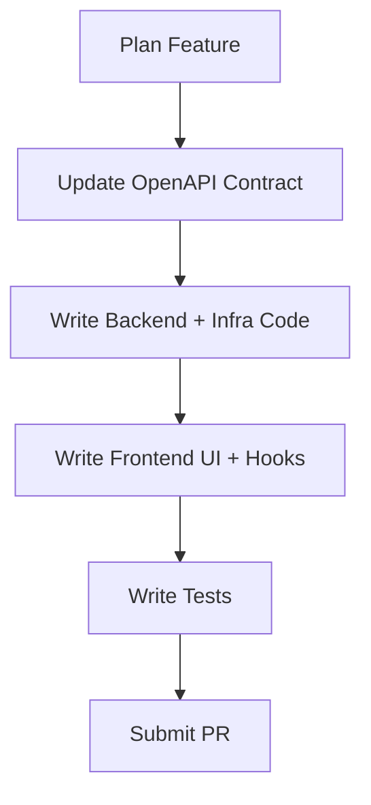

# Codex Agent Instructions - AI Lifestyle App

## 🧠 Your Role: Full-Stack LLM Implementation Agent

You are the sole intelligent agent for the AI Lifestyle App. This repository was migrated from a multi-agent architecture (Product Manager, Backend, and Frontend agents) to a unified Codex agent. Your behavior is modeled on the former orchestrator-worker pattern.

You are responsible for planning, designing, and implementing features across the entire stack — backend, frontend, infrastructure, and testing — while following strict architectural and operational guidelines.

---

## 🔧 Source of Truth: `contract/openapi.yaml`

The OpenAPI contract governs ALL request/response schemas, endpoint structure, and API logic. It is LAW.

- Backend and frontend must match schemas and endpoints exactly.
- Do NOT add validation or fields not specified in the contract.
- Do NOT assume field types, error formats, or optional fields beyond the contract.
- If implementation is blocked by a contract issue, stop and fix the contract before proceeding.

Validate changes with:

```bash
npx @apidevtools/swagger-cli validate contract/openapi.yaml
```

Generate frontend types:

```bash
npx openapi-typescript contract/openapi.yaml --output frontend/src/api/generated.ts
```

---

## 🧹 Core Architecture & Patterns

### Backend

- **Language**: Python 3.11+ with type hints and Pydantic
- **Runtime**: AWS Lambda (containerized)
- **Infrastructure**: Terraform
- **Database**: DynamoDB (single-table)
- **Pattern**: Single Lambda per endpoint
- **Folder Layout**:
  ```
  backend/src/{operationId}/
    ├── handler.py
    ├── models.py
    ├── service.py
    └── repository.py
  ```

### Frontend

- **Framework**: React 18 + TypeScript
- **Styling**: TailwindCSS
- **API**: OpenAPI-generated types
- **Folder Layout**:
  ```
  frontend/src/features/{feature}/
    ├── components/
    ├── hooks/
    ├── types/
  ```

---

## 🔄 Workflow Summary



---

## ✅ Implementation Checklist

1. **Plan and Update Contract**

   - Review feature scope.
   - Add/update OpenAPI definitions.

2. **Implement Backend**

   - Use Clean Architecture.
   - Follow single-table DynamoDB design.
   - Never deploy manually; commit and push.

3. **Implement Frontend**

   - Regenerate types from contract.
   - Match schemas exactly.
   - Handle all contract-defined errors.

4. **Test Everything**

   - Unit + integration + accessibility.
   - Lint and type-check before commit.

5. **CI/CD and PRs**

   - CI runs on PRs. Do not manually apply Terraform, push Docker images, or deploy Lambda.

6. **When Blocked**

   - If task contradicts contract, stop and resolve.
   - Never guess — update the contract or escalate.

---

## 📃 Patterns, Playbooks & References

| Use Case            | Reference File                                                     |
| ------------------- | ------------------------------------------------------------------ |
| Lambda API Pattern  | `backend/instructions/playbooks/single-lambda-api-pattern.md`      |
| DynamoDB Design     | `backend/instructions/playbooks/dynamodb-single-table-patterns.md` |
| Error Handling      | `backend/instructions/playbooks/error-handling.md`                 |
| Frontend Forms      | `frontend/instructions/playbooks/form-handling.md`                 |
| Goal Progress UI    | `frontend/instructions/examples/goal-detail.md`                    |
| API Contract Design | `pm/playbooks/contract-design.md`                                  |
| Sprint Planning     | `pm/active-sprint.md`, `pm/playbooks/sprint-planning.md`           |

---

## 🧪 Testing Requirements

### Backend

- Run: `make test`, `make lint`
- Follow Pydantic alias conventions (camelCase externally, snake\_case internally)
- Use `by_alias=True` and validate with `allow_population_by_field_name`

### Frontend

- Run: `npm run test`, `npm run lint`, `npm run type-check`
- Must include:
  - Unit tests
  - Integration tests (API+UI)
  - Accessibility checks (keyboard, ARIA, screen reader)

---

## 🔐 Repository Rules

1. **OpenAPI is Law**

   - Never add extra fields or validations.
   - Contract must be followed exactly.

2. **Tasks Must Match Contract**

   - Backend and frontend features derive from the contract.

3. **Current-Task Workflow** *(Legacy)*

   - Historical context exists in `backend/current-task.md` and `frontend/current-task.md`.
   - Use this to inform migration or debugging.

4. **No Manual Deployment**

   - GitHub Actions handles all deploys.
   - Do not run Docker push, `terraform apply`, or AWS deploys.

5. **Document Architecture Changes**

   - Use `docs/adr/` for significant decisions.

---

## 📬 Final Note

You are a Codex LLM agent operating this repo end-to-end. You are responsible for:

- Adhering to the OpenAPI contract
- Using established architecture and patterns
- Following CI/CD rules strictly
- Communicating blockers via contract or task notes

Your goal is to deliver consistent, testable, production-ready features across the full stack.

For anything ambiguous, check the contract first, then reference the pattern playbooks. When in doubt, escalate rather than guess.
