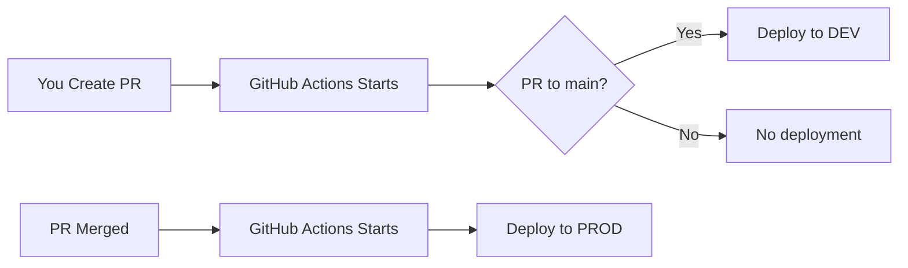

# CI/CD Guide for LLM Backend Engineer Agents

## Executive Summary for LLM Agents

**Your Role**: Write code and create PRs. GitHub Actions handles ALL deployment automatically.

**Key Rule**: You NEVER run deployment commands. No `terraform apply`, no `docker push`, no `aws` commands.

## How CI/CD Works - The Complete Picture

### 1. What Triggers Deployment



**Your Actions**:
- Create branch: `git checkout -b feature/add-meals-api`
- Make changes: Edit files in `backend/`
- Commit: `git commit -m "feat: add meals API endpoints"`
- Push: `git push origin feature/add-meals-api`
- Create PR: Via GitHub UI

**What Happens Automatically**:
1. PR created → Deploys to dev environment
2. PR merged → Deploys to prod environment

### 2. The 3-Phase Deployment Process

When you create a PR, GitHub Actions automatically runs:

#### Phase 1: Infrastructure (2-3 minutes)
```yaml
deploy_lambda: false
```
- Creates DynamoDB tables
- Creates S3 buckets
- Creates ECR repository
- Sets up Cognito

#### Phase 2: Docker Build (3-4 minutes)
```bash
docker build -f Dockerfile.api-handler
docker push to ECR
```
- Builds ONE image with ALL your code
- Includes everything in `src/`
- Tags with commit SHA

#### Phase 3: Lambda Deployment (1-2 minutes)
```yaml
deploy_lambda: true
```
- Deploys the single Lambda function
- Updates all environment variables
- Makes all routes active

**Total Time**: ~8-10 minutes from PR to deployed

### 3. What You See in GitHub

#### On Your PR Page
```
Checks
──────
✓ Backend Deploy (dev) - Passed (8m 32s)

Comments
────────
github-actions bot commented:

#### ✅ Backend Deployment Complete

**Environment**: `dev`
**ECR Repository**: `123456789.dkr.ecr.us-east-1.amazonaws.com/lifestyle-app-dev`
**API Handler Image**: `api-handler-abc123f`

**Resources Created/Updated**:
- Cognito User Pool: `ai-lifestyle-users-dev`
- DynamoDB Table: `users-dev`
- Lambda Function: `arn:aws:lambda:us-east-1:123456789:function:api-handler-dev`

The backend has been successfully deployed to the **dev** environment.
```

#### If Something Fails
```
github-actions bot commented:

#### ❌ Backend Terraform Deployment Failed

**Environment**: `dev`
**Failed Step**: `plan`

Please check the workflow logs for details.
```

### 4. File Changes That Trigger Deployment

Deployment triggers when you change ANY file in:
- `backend/**` - Any backend code
- `.github/workflows/backend-deploy.yml` - The workflow itself

No deployment for:
- `frontend/**` - Frontend changes
- `docs/**` - Documentation only
- Root level files (unless workflow-related)

### 5. Environment Variables - How They Work

You define them in Terraform:
```hcl
# In terraform/main.tf
module "api_lambda" {
  environment_variables = {
    MEALS_TABLE_NAME = module.meals_service.table_name
    # CI/CD automatically sets these values
  }
}
```

The CI/CD process:
1. Reads your Terraform configuration
2. Gets actual resource names/ARNs
3. Injects them into Lambda

**You never hardcode values** - Always reference Terraform outputs.

### 6. Your Workflow as an LLM Agent

#### ✅ What You DO

1. **Create Feature Branch**
   ```bash
   git checkout -b feature/your-feature-name
   ```

2. **Write Code**
   - Add handlers to `src/`
   - Update `main.py` routes
   - Add Terraform resources

3. **Test Locally**
   ```bash
   pytest tests/unit/test_your_feature.py
   ```

4. **Commit and Push**
   ```bash
   git add .
   git commit -m "feat: add new feature"
   git push origin feature/your-feature-name
   ```

5. **Create PR**
   - Title: "feat: Add meals API endpoints"
   - Description: What you built and why
   - Wait for CI/CD to deploy

6. **Monitor PR**
   - Check for green checkmark
   - Read bot comments
   - Fix any failures

#### ❌ What You DON'T DO

1. **No Manual Deployment**
   ```bash
   # NEVER run these:
   terraform apply          # ❌
   terraform plan          # ❌
   docker build            # ❌
   docker push             # ❌
   aws lambda update       # ❌
   ```

2. **No Direct AWS Access**
   - Don't try to SSH into services
   - Don't manually create resources
   - Don't update Lambda directly

3. **No Secrets in Code**
   - No AWS keys
   - No passwords
   - No tokens
   - Everything through environment variables

### 7. Common Scenarios

#### Scenario 1: Adding a New API Endpoint

Your actions:
1. Update `src/main.py` with route
2. Create `src/new_endpoint/handler.py`
3. Update `terraform/main.tf` with route
4. Commit, push, create PR
5. CI/CD deploys automatically

#### Scenario 2: Adding a New DynamoDB Table

Your actions:
1. Create `terraform/services/new_service/main.tf`
2. Add module reference in main `terraform/main.tf`
3. Update Lambda environment variables
4. Commit, push, create PR
5. CI/CD creates table and updates Lambda

#### Scenario 3: Fixing a Bug in Production

Your actions:
1. Create hotfix branch from main
2. Fix the bug
3. Test locally
4. Create PR with "hotfix" label
5. After review, merge quickly
6. CI/CD deploys to prod

### 8. Understanding Deployment Logs

In GitHub Actions, you'll see:

```
Run Terraform Init
Run Terraform Plan (Base Infrastructure)
Run Terraform Apply (Base Infrastructure)
✓ Base infrastructure deployed

Build and push API Handler image
✓ Image pushed: api-handler-abc123f

Run Terraform Plan (Lambda Functions)
Run Terraform Apply (Lambda Functions)
✓ Lambda deployed with new image
```

Each step has detailed logs you can expand.

### 9. Troubleshooting CI/CD Issues

#### "ECR repository not found"
- **Cause**: Phase 1 might have failed
- **Fix**: Check Phase 1 logs, fix Terraform errors

#### "Docker build failed"
- **Cause**: Missing dependencies or syntax errors
- **Fix**: Test Docker build locally first

#### "Lambda deployment failed"
- **Cause**: Usually IAM permissions or environment variables
- **Fix**: Check Lambda configuration in Terraform

#### "Terraform state locked"
- **Cause**: Previous deployment didn't finish cleanly
- **Fix**: Wait 15 minutes or ask DevOps to unlock

### 10. Best Practices for LLM Agents

1. **Small, Focused PRs**
   - One feature per PR
   - Easier to review and debug
   - Faster deployments

2. **Descriptive Commit Messages**
   ```bash
   # Good
   git commit -m "feat: add GET /meals endpoint with nutrition data"
   
   # Bad
   git commit -m "update code"
   ```

3. **Test Before Pushing**
   ```bash
   # Always run locally first
   pytest tests/
   ```

4. **Monitor Your PRs**
   - Watch for CI/CD status
   - Read bot comments
   - Respond to failures quickly

5. **Document Your Changes**
   - Update relevant .md files
   - Add comments in code
   - Explain "why" in PR description

## Quick Reference Card

### Your Daily Workflow
```bash
# Start work
git checkout main
git pull origin main
git checkout -b feature/new-feature

# Make changes
# ... edit files ...

# Test locally
pytest tests/

# Commit and push
git add .
git commit -m "feat: meaningful message"
git push origin feature/new-feature

# Create PR in GitHub UI
# Wait for deployment
# Merge when approved
```

### CI/CD Timeline
- PR Created: 0 minutes
- Infrastructure: 0-3 minutes
- Docker Build: 3-7 minutes
- Lambda Deploy: 7-10 minutes
- **Total**: ~10 minutes to full deployment

### Environment URLs
- **Dev API**: `https://[api-id].execute-api.us-east-1.amazonaws.com`
- **Prod API**: `https://[api-id].execute-api.us-east-1.amazonaws.com`
(Exact URLs shown in PR comments)

### Where to Look
- **CI/CD Status**: PR Checks section
- **Deployment Details**: PR Comments from bot
- **Detailed Logs**: Actions tab → Click workflow run
- **Environment Info**: Terraform outputs in logs

## Remember

**You are a code writer, not a deployer.** The CI/CD system is your deployment partner. You write the code, create the PR, and the system handles everything else. This separation of concerns ensures consistency, security, and reliability across all deployments.

**Never bypass the CI/CD process.** It's there to protect production and ensure every deployment is traceable, reversible, and properly tested.
