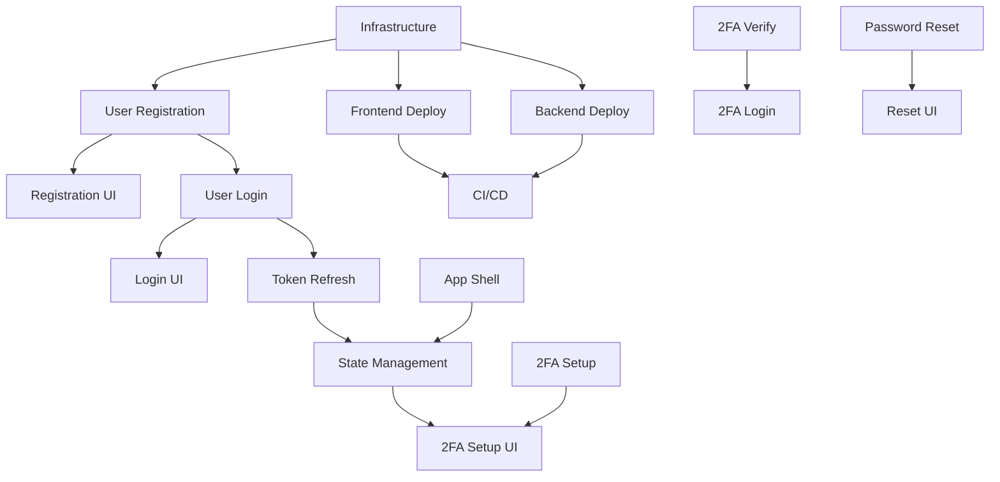

# Authentication Milestone - Task Breakdown

## 🎯 Milestone Overview
Deliver a production-ready authentication system with 2FA support, hosted on AWS with CloudFront.

## 📋 Task Breakdown by Agent

### Backend Agent Tasks

#### Week 1: Core Authentication
1. **Task B1: Complete User Registration** (In Progress)
   - Implement `registerUser` Lambda
   - Cognito integration
   - DynamoDB user record
   - Email verification trigger
   - **Estimate**: 6 hours

2. **Task B2: User Login Endpoint**
   - Implement `loginUser` Lambda
   - Handle MFA-required response
   - JWT token generation
   - Session management
   - **Estimate**: 4 hours

3. **Task B3: Token Refresh Endpoint**
   - Implement `refreshToken` Lambda
   - Token rotation strategy
   - Revocation handling
   - **Estimate**: 3 hours

4. **Task B4: Core Infrastructure**
   - Cognito User Pool setup
   - DynamoDB table creation
   - API Gateway configuration
   - Lambda deployment pipeline
   - **Estimate**: 8 hours

#### Week 2: Enhanced Security
5. **Task B5: 2FA Setup Endpoints**
   - Implement `setupMfa` Lambda
   - TOTP secret generation
   - QR code generation
   - Backup codes
   - **Estimate**: 6 hours

6. **Task B6: 2FA Verification**
   - Implement `verifyMfaSetup` Lambda
   - Implement `verifyMfa` Lambda
   - Implement `disableMfa` Lambda
   - **Estimate**: 5 hours

7. **Task B7: Password Reset Flow**
   - Implement `requestPasswordReset` Lambda
   - Implement `confirmPasswordReset` Lambda
   - Email templates
   - Token expiration
   - **Estimate**: 4 hours

8. **Task B8: Production Hardening**
   - Rate limiting implementation
   - Security headers
   - WAF rules
   - Monitoring/alerting
   - **Estimate**: 6 hours

### Frontend Agent Tasks

#### Week 1: Core UI Components
1. **Task F1: Complete Registration UI** (In Progress)
   - Registration form with validation
   - Password strength meter
   - Success/error states
   - **Estimate**: 4 hours

2. **Task F2: Login UI**
   - Login form component
   - Remember me functionality
   - MFA code input (conditional)
   - Session persistence
   - **Estimate**: 4 hours

3. **Task F3: App Shell & Routing**
   - React Router setup
   - Protected route component
   - Navigation component
   - Layout structure
   - **Estimate**: 6 hours

4. **Task F4: State Management**
   - Auth context setup
   - Token storage (secure)
   - Auto-refresh logic
   - Logout functionality
   - **Estimate**: 4 hours

#### Week 2: Advanced Features
5. **Task F5: 2FA Setup UI**
   - QR code display
   - Secret key display
   - Backup codes display
   - Verification flow
   - **Estimate**: 6 hours

6. **Task F6: 2FA Login Flow**
   - MFA code input component
   - Backup code option
   - Error handling
   - **Estimate**: 3 hours

7. **Task F7: Password Reset UI**
   - Request reset form
   - Reset confirmation form
   - Email sent confirmation
   - **Estimate**: 4 hours

8. **Task F8: Profile Management**
   - Profile view/edit forms
   - 2FA enable/disable
   - Email verification status
   - **Estimate**: 5 hours

### DevOps Tasks (PM/Backend Collaboration)

1. **Task D1: Frontend Deployment Pipeline**
   - S3 bucket setup
   - CloudFront distribution
   - Domain configuration
   - SSL certificates
   - **Estimate**: 4 hours

2. **Task D2: Backend Deployment Pipeline**
   - ECR repositories
   - Lambda deployment scripts
   - Environment management
   - **Estimate**: 4 hours

3. **Task D3: CI/CD Setup**
   - GitHub Actions workflows
   - Automated testing
   - Deployment approvals
   - **Estimate**: 6 hours

## 📊 Task Dependencies

## 🏁 Definition of Done

### For Each Endpoint
- [ ] Lambda function implemented
- [ ] Unit tests >90% coverage
- [ ] Integration tests passing
- [ ] Contract tests passing
- [ ] Terraform resources defined
- [ ] Error handling comprehensive
- [ ] Logging configured
- [ ] Metrics/alarms set up

### For Each UI Component
- [ ] Component fully functional
- [ ] Responsive design
- [ ] Accessible (WCAG 2.1 AA)
- [ ] Loading/error states
- [ ] Unit tests written
- [ ] Integration tests written
- [ ] Storybook documented

### For Infrastructure
- [ ] All resources terraformed
- [ ] Multi-environment support
- [ ] Backup/recovery configured
- [ ] Security best practices
- [ ] Cost optimization applied
- [ ] Monitoring dashboards
- [ ] Runbook documented

## 🚦 Success Criteria

### Performance
- API response time <200ms (p95)
- Frontend load time <3s
- Lambda cold start <1s

### Security
- All endpoints require auth (except public ones)
- 2FA adoption >30% within first month
- No high/critical vulnerabilities
- Rate limiting effective

### Reliability
- 99.9% uptime
- Zero data loss
- Graceful degradation
- Error recovery

### User Experience
- Registration completion >80%
- Login success rate >95%
- 2FA setup completion >70%
- Mobile-friendly confirmed

## 📅 Timeline

### Week 1 Deliverables
- Basic auth working end-to-end
- Frontend deployed to CloudFront
- Dev environment fully operational
- Core infrastructure in place

### Week 2 Deliverables
- 2FA fully implemented
- Password reset working
- Production environment ready
- All security measures in place
- Documentation complete

## 🔄 Daily Sync Points
- **9 AM**: Task status check
- **2 PM**: Blocker resolution
- **5 PM**: Progress update

## 📝 Communication Protocol
- Update task status in respective `current-task.md`
- Flag blockers immediately
- Request clarification via task comments
- Complete work = update with completion report