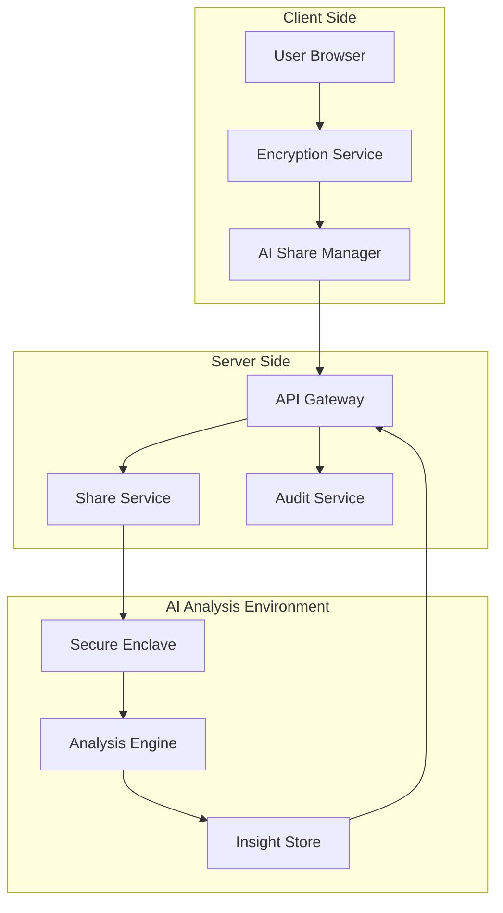
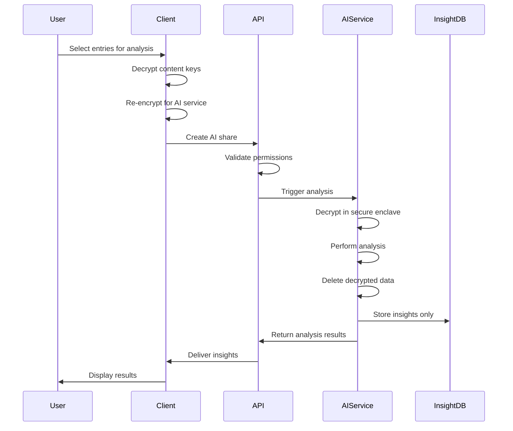

# AI Analysis Sharing - Technical Specification

## Executive Summary

This feature extends our end-to-end encryption system to enable selective, user-controlled AI analysis of encrypted entries. Users can temporarily share specific encrypted entries with an AI analysis service while maintaining zero-knowledge principles and complete privacy control.

## Core Concepts

### 1. AI Service as Trusted Entity
The AI analysis service operates as a special "user" in our encryption system with:
- Its own RSA-4096 public/private keypair
- Isolated secure processing environment
- Strict data retention policies
- Audit logging for all operations

### 2. Selective Sharing Model
Users explicitly choose:
- Which entries to analyze
- What type of analysis to perform
- How long the AI can retain decrypted data
- What insights can be stored

### 3. Zero-Knowledge Preservation
- Server never sees unencrypted content
- AI service runs in isolated environment
- Decrypted data exists only during analysis
- Only derived insights are persisted

## Technical Architecture

### System Components



### Data Flow



## Data Models

### AI Share Record

```typescript
interface AIAnalysisShare {
  shareId: string;
  userId: string;
  
  // Encryption details
  entries: Array<{
    entryId: string;
    encryptedContentKey: string;  // Key encrypted for AI service
    allowedFields?: string[];      // Optional field filtering
  }>;
  
  // Analysis configuration
  analysis: {
    type: 'mood' | 'patterns' | 'goals' | 'wellness' | 'custom';
    parameters?: Record<string, any>;
    modelVersion: string;
  };
  
  // Privacy controls
  permissions: {
    retentionPeriod: 'ephemeral' | '24h' | '7d' | '30d';
    allowCrossEntryAnalysis: boolean;
    allowHistoricalComparison: boolean;
    allowModelTraining: boolean;
    dataUsage: 'personal' | 'aggregate' | 'research';
  };
  
  // Metadata
  createdAt: Date;
  expiresAt: Date;
  processedAt?: Date;
  status: 'pending' | 'processing' | 'completed' | 'failed' | 'expired';
}
```

### AI Analysis Result

```typescript
interface AIAnalysisResult {
  resultId: string;
  shareId: string;
  userId: string;
  
  // Analysis output
  insights: {
    summary: string;
    confidence: number;
    findings: Array<{
      type: string;
      description: string;
      evidence: string[];  // References, not raw content
      strength: 'strong' | 'moderate' | 'weak';
    }>;
  };
  
  // Patterns detected
  patterns?: {
    temporal: TemporalPattern[];
    behavioral: BehavioralPattern[];
    emotional: EmotionalPattern[];
    correlations: Correlation[];
  };
  
  // Recommendations
  recommendations?: Array<{
    type: string;
    action: string;
    rationale: string;
    priority: 'high' | 'medium' | 'low';
    relatedGoals?: string[];
  }>;
  
  // Metadata
  analysisVersion: string;
  processingTime: number;
  entryCount: number;
  dateRange: {
    start: Date;
    end: Date;
  };
  createdAt: Date;
  validUntil: Date;
}
```

### AI Service Configuration

```typescript
interface AIServiceConfig {
  serviceId: string;
  publicKey: string;
  publicKeyId: string;
  
  capabilities: {
    analysisTypes: string[];
    maxEntriesPerRequest: number;
    maxRetentionPeriod: string;
    supportedLanguages: string[];
  };
  
  security: {
    enclaveTechnology: 'SGX' | 'TrustZone' | 'SEV';
    attestationCertificate: string;
    complianceCertifications: string[];
  };
  
  endpoints: {
    analyze: string;
    status: string;
    capabilities: string;
  };
}
```

## API Endpoints

### 1. Create AI Analysis Share

```yaml
POST /api/v1/ai-analysis/shares
Authorization: Bearer <token>

Request:
{
  "entryIds": ["entry1", "entry2", "entry3"],
  "analysisType": "mood",
  "permissions": {
    "retentionPeriod": "24h",
    "allowCrossEntryAnalysis": true,
    "allowHistoricalComparison": false,
    "dataUsage": "personal"
  },
  "parameters": {
    "depth": "detailed",
    "compareToBaseline": true
  }
}

Response:
{
  "shareId": "share_abc123",
  "status": "pending",
  "estimatedProcessingTime": 30,
  "expiresAt": "2024-01-08T12:00:00Z"
}
```

### 2. Get Analysis Status

```yaml
GET /api/v1/ai-analysis/shares/{shareId}/status
Authorization: Bearer <token>

Response:
{
  "shareId": "share_abc123",
  "status": "processing",
  "progress": 65,
  "currentStep": "pattern_detection",
  "estimatedTimeRemaining": 10
}
```

### 3. Retrieve Analysis Results

```yaml
GET /api/v1/ai-analysis/results/{shareId}
Authorization: Bearer <token>

Response:
{
  "resultId": "result_xyz789",
  "insights": {
    "summary": "Your mood has shown improvement over the selected period...",
    "confidence": 0.87,
    "findings": [...]
  },
  "recommendations": [...],
  "validUntil": "2024-01-15T12:00:00Z"
}
```

### 4. Delete Analysis Share

```yaml
DELETE /api/v1/ai-analysis/shares/{shareId}
Authorization: Bearer <token>

Response:
{
  "message": "Analysis share and all associated data deleted",
  "deletedAt": "2024-01-07T10:30:00Z"
}
```

## Frontend Implementation

### 1. AI Analysis Service

```typescript
// services/aiAnalysis.service.ts
export class AIAnalysisService {
  constructor(
    private encryptionService: EncryptionService,
    private api: APIClient
  ) {}
  
  async createAnalysisShare(
    entryIds: string[],
    analysisType: AnalysisType,
    options: AnalysisOptions
  ): Promise<AIAnalysisShare> {
    // 1. Get AI service public key
    const aiPublicKey = await this.getAIServicePublicKey();
    
    // 2. Prepare encrypted keys for each entry
    const encryptedEntries = await Promise.all(
      entryIds.map(async (entryId) => {
        const entry = await this.api.getEntry(entryId);
        const contentKey = await this.encryptionService.decryptContentKey(
          entry.encryptedContentKey
        );
        
        const reencryptedKey = await this.encryptionService.encryptForRecipient(
          contentKey,
          aiPublicKey
        );
        
        return {
          entryId,
          encryptedContentKey: reencryptedKey
        };
      })
    );
    
    // 3. Create share on server
    return await this.api.createAIAnalysisShare({
      entries: encryptedEntries,
      analysisType,
      permissions: options.permissions,
      parameters: options.parameters
    });
  }
  
  async waitForResults(
    shareId: string,
    onProgress?: (progress: number) => void
  ): Promise<AIAnalysisResult> {
    return new Promise((resolve, reject) => {
      const pollInterval = setInterval(async () => {
        try {
          const status = await this.api.getAnalysisStatus(shareId);
          
          if (onProgress) {
            onProgress(status.progress);
          }
          
          if (status.status === 'completed') {
            clearInterval(pollInterval);
            const results = await this.api.getAnalysisResults(shareId);
            resolve(results);
          } else if (status.status === 'failed') {
            clearInterval(pollInterval);
            reject(new Error('Analysis failed'));
          }
        } catch (error) {
          clearInterval(pollInterval);
          reject(error);
        }
      }, 2000); // Poll every 2 seconds
    });
  }
}
```

### 2. React Components

```typescript
// components/AIAnalysis/AIAnalysisDialog.tsx
export const AIAnalysisDialog: React.FC<{
  selectedEntries: JournalEntry[];
  onClose: () => void;
}> = ({ selectedEntries, onClose }) => {
  const [analysisType, setAnalysisType] = useState<AnalysisType>('mood');
  const [retentionPeriod, setRetentionPeriod] = useState('24h');
  const [isProcessing, setIsProcessing] = useState(false);
  const [progress, setProgress] = useState(0);
  const [results, setResults] = useState<AIAnalysisResult | null>(null);
  
  const aiAnalysisService = useAIAnalysisService();
  
  const handleAnalyze = async () => {
    setIsProcessing(true);
    
    try {
      const share = await aiAnalysisService.createAnalysisShare(
        selectedEntries.map(e => e.id),
        analysisType,
        {
          permissions: {
            retentionPeriod,
            allowCrossEntryAnalysis: true,
            allowHistoricalComparison: false,
            dataUsage: 'personal'
          }
        }
      );
      
      const results = await aiAnalysisService.waitForResults(
        share.shareId,
        setProgress
      );
      
      setResults(results);
    } catch (error) {
      toast.error('Analysis failed: ' + error.message);
    } finally {
      setIsProcessing(false);
    }
  };
  
  if (results) {
    return <AIAnalysisResults results={results} onClose={onClose} />;
  }
  
  return (
    <Dialog open onClose={onClose}>
      <DialogTitle>
        <Box display="flex" alignItems="center" gap={1}>
          <BrainIcon />
          AI Analysis Request
        </Box>
      </DialogTitle>
      
      <DialogContent>
        <Alert severity="info" sx={{ mb: 2 }}>
          <AlertTitle>Privacy Notice</AlertTitle>
          Selected entries will be temporarily decrypted in a secure environment
          for analysis. The AI will only process these specific entries.
        </Alert>
        
        <FormControl fullWidth sx={{ mb: 2 }}>
          <InputLabel>Analysis Type</InputLabel>
          <Select value={analysisType} onChange={(e) => setAnalysisType(e.target.value)}>
            <MenuItem value="mood">
              <ListItemIcon><MoodIcon /></ListItemIcon>
              <ListItemText 
                primary="Mood Patterns"
                secondary="Analyze emotional patterns and trends"
              />
            </MenuItem>
            <MenuItem value="goals">
              <ListItemIcon><TargetIcon /></ListItemIcon>
              <ListItemText 
                primary="Goal Alignment"
                secondary="Check progress and alignment with goals"
              />
            </MenuItem>
            <MenuItem value="wellness">
              <ListItemIcon><HeartIcon /></ListItemIcon>
              <ListItemText 
                primary="Wellness Insights"
                secondary="Overall wellness and health patterns"
              />
            </MenuItem>
          </Select>
        </FormControl>
        
        <FormControl fullWidth sx={{ mb: 2 }}>
          <InputLabel>Data Retention</InputLabel>
          <Select value={retentionPeriod} onChange={(e) => setRetentionPeriod(e.target.value)}>
            <MenuItem value="ephemeral">Delete immediately after analysis</MenuItem>
            <MenuItem value="24h">Keep for 24 hours</MenuItem>
            <MenuItem value="7d">Keep for 7 days</MenuItem>
          </Select>
        </FormControl>
        
        <Box sx={{ mt: 3 }}>
          <Typography variant="subtitle2" gutterBottom>
            Selected Entries ({selectedEntries.length})
          </Typography>
          <List dense>
            {selectedEntries.slice(0, 3).map(entry => (
              <ListItem key={entry.id}>
                <ListItemText
                  primary={entry.title || `Entry from ${formatDate(entry.createdAt)}`}
                  secondary={`${entry.wordCount} words`}
                />
              </ListItem>
            ))}
            {selectedEntries.length > 3 && (
              <ListItem>
                <ListItemText 
                  secondary={`... and ${selectedEntries.length - 3} more entries`}
                />
              </ListItem>
            )}
          </List>
        </Box>
      </DialogContent>
      
      <DialogActions>
        <Button onClick={onClose}>Cancel</Button>
        <Button
          variant="contained"
          onClick={handleAnalyze}
          disabled={isProcessing}
          startIcon={isProcessing ? <CircularProgress size={20} /> : <PlayIcon />}
        >
          {isProcessing ? `Analyzing... ${progress}%` : 'Start Analysis'}
        </Button>
      </DialogActions>
    </Dialog>
  );
};
```

## Backend Implementation

### 1. AI Share Service

```typescript
// services/aiShare.service.ts
export class AIShareService {
  constructor(
    private db: Database,
    private auditService: AuditService,
    private aiClient: AIAnalysisClient
  ) {}
  
  async createShare(
    userId: string,
    request: CreateAIShareRequest
  ): Promise<AIAnalysisShare> {
    // Validate user owns all entries
    const entries = await this.db.entries.findMany({
      where: {
        id: { in: request.entryIds },
        userId
      }
    });
    
    if (entries.length !== request.entryIds.length) {
      throw new ForbiddenError('Cannot share entries you do not own');
    }
    
    // Create share record
    const share = await this.db.aiShares.create({
      data: {
        shareId: generateId('share'),
        userId,
        entries: request.entries,
        analysis: {
          type: request.analysisType,
          parameters: request.parameters,
          modelVersion: AI_MODEL_VERSION
        },
        permissions: request.permissions,
        status: 'pending',
        createdAt: new Date(),
        expiresAt: this.calculateExpiration(request.permissions.retentionPeriod)
      }
    });
    
    // Audit log
    await this.auditService.log({
      userId,
      action: 'ai_share_created',
      resourceType: 'ai_share',
      resourceId: share.shareId,
      metadata: {
        entryCount: request.entryIds.length,
        analysisType: request.analysisType,
        retention: request.permissions.retentionPeriod
      }
    });
    
    // Trigger async analysis
    this.triggerAnalysis(share);
    
    return share;
  }
  
  private async triggerAnalysis(share: AIAnalysisShare): Promise<void> {
    try {
      // Update status
      await this.db.aiShares.update({
        where: { shareId: share.shareId },
        data: { status: 'processing' }
      });
      
      // Send to AI service
      const result = await this.aiClient.analyze({
        shareId: share.shareId,
        entries: share.entries,
        analysisType: share.analysis.type,
        parameters: share.analysis.parameters
      });
      
      // Store results
      await this.db.aiResults.create({
        data: {
          resultId: generateId('result'),
          shareId: share.shareId,
          userId: share.userId,
          insights: result.insights,
          patterns: result.patterns,
          recommendations: result.recommendations,
          metadata: result.metadata,
          createdAt: new Date(),
          validUntil: share.expiresAt
        }
      });
      
      // Update share status
      await this.db.aiShares.update({
        where: { shareId: share.shareId },
        data: { 
          status: 'completed',
          processedAt: new Date()
        }
      });
      
    } catch (error) {
      await this.db.aiShares.update({
        where: { shareId: share.shareId },
        data: { 
          status: 'failed',
          error: error.message
        }
      });
      
      throw error;
    }
  }
}
```

### 2. AI Analysis Client

```typescript
// clients/aiAnalysis.client.ts
export class AIAnalysisClient {
  private privateKey: CryptoKey;
  
  constructor(
    private config: AIServiceConfig,
    privateKeyPath: string
  ) {
    this.privateKey = this.loadPrivateKey(privateKeyPath);
  }
  
  async analyze(request: AnalysisRequest): Promise<AnalysisResult> {
    // 1. Decrypt content keys in secure enclave
    const decryptedEntries = await this.decryptEntries(request.entries);
    
    try {
      // 2. Perform analysis
      const insights = await this.runAnalysis(
        decryptedEntries,
        request.analysisType,
        request.parameters
      );
      
      // 3. Clean up decrypted data immediately
      this.secureDelete(decryptedEntries);
      
      // 4. Return only insights
      return {
        insights,
        metadata: {
          analysisVersion: this.config.version,
          processingTime: Date.now() - startTime,
          entryCount: request.entries.length
        }
      };
      
    } finally {
      // Ensure cleanup even on error
      this.secureDelete(decryptedEntries);
    }
  }
  
  private async decryptEntries(
    encryptedEntries: EncryptedEntry[]
  ): Promise<DecryptedEntry[]> {
    return Promise.all(
      encryptedEntries.map(async (entry) => {
        // Decrypt content key with AI service private key
        const contentKey = await this.decryptKey(
          entry.encryptedContentKey,
          this.privateKey
        );
        
        // Decrypt content
        const content = await this.decryptContent(
          entry.encryptedContent,
          contentKey,
          entry.iv
        );
        
        return {
          id: entry.entryId,
          content,
          metadata: entry.metadata
        };
      })
    );
  }
  
  private secureDelete(entries: DecryptedEntry[]): void {
    // Overwrite memory with random data
    entries.forEach(entry => {
      const buffer = new TextEncoder().encode(entry.content);
      crypto.getRandomValues(buffer);
      entry.content = '';
    });
    
    // Force garbage collection if available
    if (global.gc) {
      global.gc();
    }
  }
}
```

## Security Considerations

### 1. Secure Enclave Requirements
- Hardware-backed secure execution environment
- Attestation for code integrity
- Memory encryption during processing
- No persistent storage of decrypted data

### 2. Access Controls
- Rate limiting per user (e.g., 10 analyses per day)
- Maximum entries per analysis (e.g., 100)
- Require recent authentication for AI sharing
- IP-based restrictions for sensitive operations

### 3. Audit Requirements
```typescript
interface AIAnalysisAudit {
  // Required fields
  userId: string;
  shareId: string;
  action: 'create' | 'process' | 'complete' | 'delete' | 'expire';
  timestamp: Date;
  
  // Security context
  ipAddress: string;
  userAgent: string;
  deviceId?: string;
  
  // Analysis details
  entryCount: number;
  analysisType: string;
  retentionPeriod: string;
  
  // Results
  success: boolean;
  processingTime?: number;
  errorMessage?: string;
}
```

### 4. Data Retention Policies
- Ephemeral: Delete immediately after processing
- 24h: Delete after 24 hours
- 7d: Delete after 7 days
- 30d: Delete after 30 days (premium only)
- Automatic deletion job runs every hour

## Performance Optimization

### 1. Batch Processing
```typescript
class AIBatchProcessor {
  private queue: AnalysisRequest[] = [];
  private processing = false;
  
  async addToQueue(request: AnalysisRequest): Promise<void> {
    this.queue.push(request);
    
    if (!this.processing && this.queue.length >= BATCH_SIZE) {
      await this.processBatch();
    }
  }
  
  private async processBatch(): Promise<void> {
    this.processing = true;
    const batch = this.queue.splice(0, BATCH_SIZE);
    
    try {
      await this.aiClient.analyzeBatch(batch);
    } finally {
      this.processing = false;
    }
  }
}
```

### 2. Caching
- Cache AI service public key (1 hour TTL)
- Cache analysis results (respecting retention period)
- Cache user's analysis history metadata

### 3. Progressive Results
```typescript
interface ProgressiveAnalysis {
  immediate: {
    wordCount: number;
    sentiment: 'positive' | 'negative' | 'neutral';
    topics: string[];
  };
  
  detailed: {
    patterns: Pattern[];
    insights: Insight[];
    correlations: Correlation[];
  };
  
  comprehensive: {
    recommendations: Recommendation[];
    predictions: Prediction[];
    comparisons: Comparison[];
  };
}
```

## Testing Strategy

### 1. Unit Tests
- Encryption/decryption operations
- Key management
- Permission validation
- Retention policy enforcement

### 2. Integration Tests
- End-to-end analysis flow
- Error handling and recovery
- Concurrent request handling
- Expiration and cleanup

### 3. Security Tests
- Penetration testing of secure enclave
- Attempt to access decrypted data
- Timing attack prevention
- Memory dump analysis

### 4. Performance Tests
- Analysis latency under load
- Memory usage during processing
- Concurrent analysis capacity
- Cleanup effectiveness

## Rollout Plan

### Phase 1: Beta Testing (Week 1-2)
- Deploy to staging environment
- Internal team testing
- Security audit
- Performance baseline

### Phase 2: Limited Release (Week 3-4)
- 5% of premium users
- Monitor metrics closely
- Gather feedback
- Fix issues

### Phase 3: General Availability (Week 5-6)
- All premium users
- Marketing announcement
- Support documentation
- Success metrics tracking

## Success Metrics

### Adoption
- 30% of premium users try within first month
- 15% regular usage (weekly)
- 4.5+ star rating

### Performance
- <5s average analysis time
- 99.9% success rate
- <100ms encryption overhead

### Business
- 20% increase in premium conversions
- 25% reduction in churn for users who use AI analysis
- 40% of analyses lead to goal adjustments

## Future Enhancements

### 1. Advanced Analysis Types
- Therapy preparation summaries
- Medical symptom tracking
- Financial insights
- Relationship patterns

### 2. Integrations
- Export insights to health apps
- Share with healthcare providers
- Connect to goal recommendations
- Feed into coaching features

### 3. Privacy Enhancements
- Homomorphic encryption exploration
- Federated learning implementation
- Differential privacy for aggregates
- Client-side analysis options

This technical specification provides a complete blueprint for implementing secure AI analysis of encrypted entries while maintaining our zero-knowledge architecture!