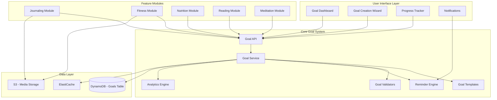
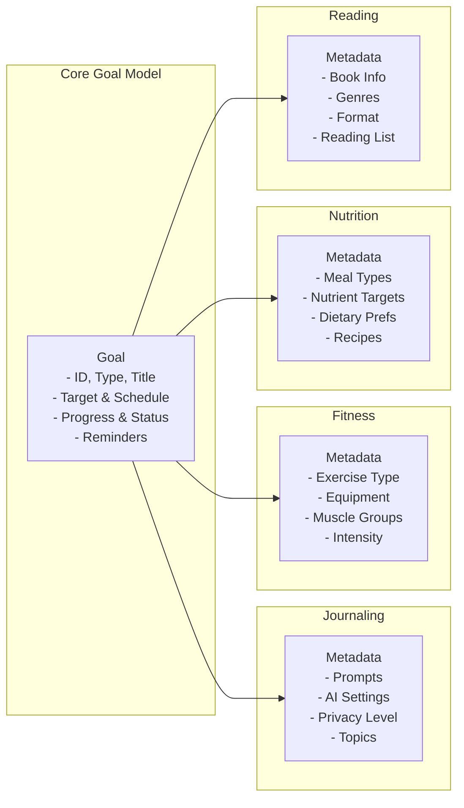
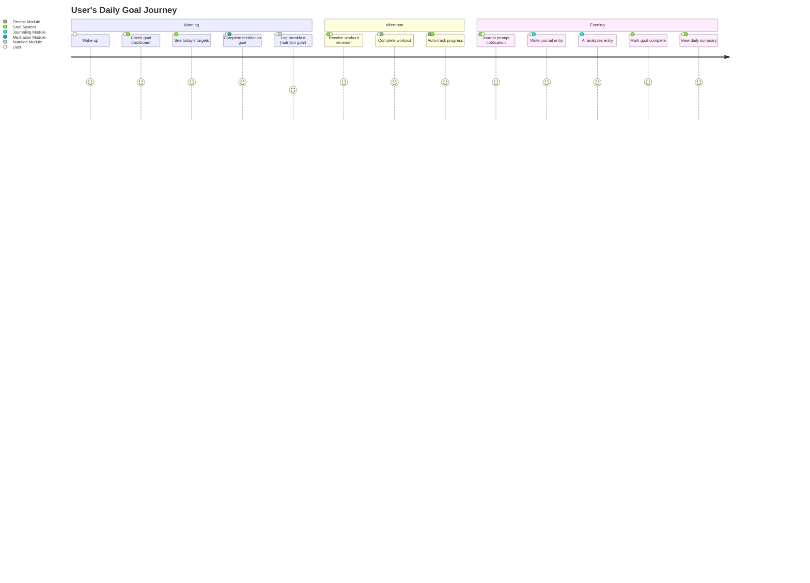
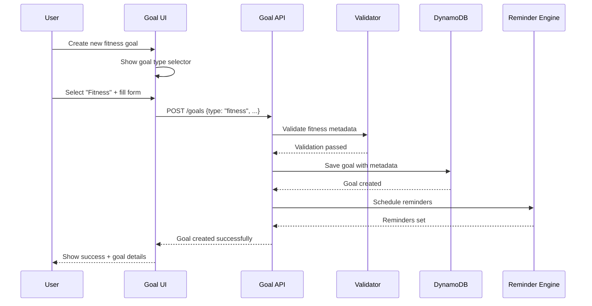
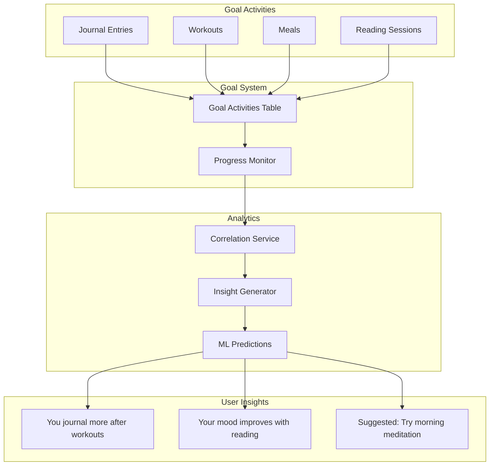
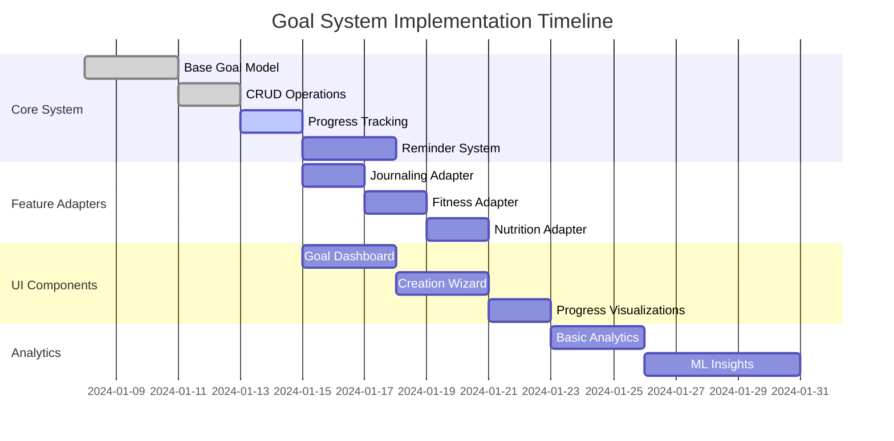

# Generic Goal System - Visual Architecture

## System Overview



## Goal Types and Their Metadata



## User Journey: Cross-Feature Goals



## Data Flow Example: Creating a Goal



## Analytics Integration



## Component Hierarchy

```
Goal System Components
├── Core Components (Shared)
│   ├── GoalCard
│   ├── GoalProgress
│   ├── StreakTracker
│   ├── ReminderSettings
│   └── GoalAnalytics
├── Creation Components
│   ├── GoalTypeSelector
│   ├── TargetConfigurator
│   ├── ScheduleBuilder
│   └── MetadataForms
│       ├── JournalingForm
│       ├── FitnessForm
│       ├── NutritionForm
│       └── ReadingForm
└── Feature Integrations
    ├── JournalEntryGoalLink
    ├── WorkoutGoalTracker
    ├── MealGoalChecker
    └── ReadingSessionLogger
```

## Database Query Patterns

```
Access Patterns:
1. Get all active goals for user
   PK: USER#123, SK: begins_with(GOAL#), filter: status = 'active'

2. Get goals by type
   GSI1PK: TYPE#fitness, GSI1SK: USER#123

3. Get goals needing reminders
   GSI2PK: REMINDER#2024-01-15T09:00:00Z

4. Get goal with activities
   PK: GOAL#456, SK: begins_with(ACTIVITY#)

5. Get user's activities by date
   GSI3PK: USER#123, GSI3SK: begins_with(2024-01-15)
```

## Implementation Phases



This architecture ensures that all lifestyle features can leverage the same robust goal system while maintaining their unique requirements through metadata extensions.
