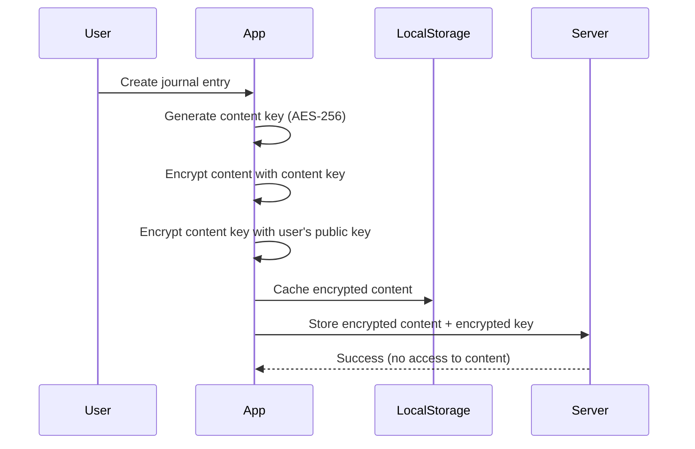
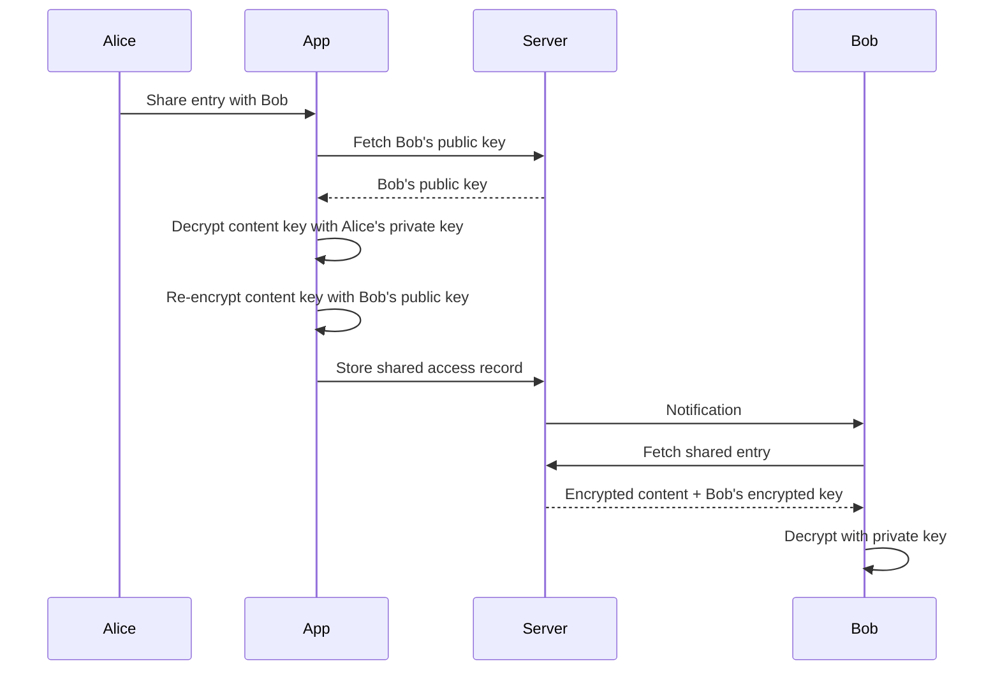

# Client-Side Encryption Architecture

## Overview
A zero-knowledge encryption system where users maintain control of their encryption keys, with the ability to securely share content with specific friends.

## Core Principles
1. **Zero-Knowledge**: Servers never see unencrypted content or keys
2. **User Control**: Users own and manage their encryption keys
3. **Selective Sharing**: Encrypted content can be shared with specific users
4. **Recovery Options**: Balance security with recoverability
5. **Performance**: Minimal impact on user experience

## Encryption Architecture

### 1. Key Hierarchy

```typescript
interface UserKeychain {
  // Master Key - Never leaves the device
  masterKey: CryptoKey;  // Derived from password + salt
  
  // Personal Keys - Stored encrypted on server
  personalKeys: {
    privateKey: CryptoKey;      // RSA-4096 or Ed25519
    publicKey: CryptoKey;       // For others to encrypt for you
    publicKeyId: string;        // Public identifier
  };
  
  // Content Keys - Per item encryption
  contentKeys: Map<string, {
    key: CryptoKey;             // AES-256-GCM key
    encryptedKey: ArrayBuffer;  // Encrypted with personal private key
  }>;
  
  // Recovery Key - Optional
  recoveryKey?: {
    encryptedMasterKey: string; // Master key encrypted with recovery phrase
    hint: string;               // User-defined hint
  };
}
```

### 2. Encryption Flow



### 3. Sharing Flow



## Implementation Details

### 1. User Registration with Encryption

```typescript
class EncryptionService {
  async setupUserEncryption(password: string): Promise<UserKeychain> {
    // 1. Derive master key from password
    const salt = crypto.getRandomValues(new Uint8Array(32));
    const masterKey = await this.deriveMasterKey(password, salt);
    
    // 2. Generate personal keypair
    const keyPair = await crypto.subtle.generateKey(
      {
        name: "RSA-OAEP",
        modulusLength: 4096,
        publicExponent: new Uint8Array([1, 0, 1]),
        hash: "SHA-256"
      },
      true,
      ["encrypt", "decrypt"]
    );
    
    // 3. Encrypt private key with master key
    const encryptedPrivateKey = await this.encryptKey(
      keyPair.privateKey,
      masterKey
    );
    
    // 4. Store on server
    await api.storeEncryptedKeys({
      publicKey: await this.exportKey(keyPair.publicKey),
      encryptedPrivateKey: encryptedPrivateKey,
      salt: this.arrayToBase64(salt),
      keyDerivationMethod: "PBKDF2-SHA256-100000"
    });
    
    return {
      masterKey,
      personalKeys: {
        privateKey: keyPair.privateKey,
        publicKey: keyPair.publicKey,
        publicKeyId: await this.generateKeyId(keyPair.publicKey)
      },
      contentKeys: new Map()
    };
  }
  
  private async deriveMasterKey(
    password: string, 
    salt: Uint8Array
  ): Promise<CryptoKey> {
    const keyMaterial = await crypto.subtle.importKey(
      "raw",
      new TextEncoder().encode(password),
      "PBKDF2",
      false,
      ["deriveBits", "deriveKey"]
    );
    
    return crypto.subtle.deriveKey(
      {
        name: "PBKDF2",
        salt: salt,
        iterations: 100000,
        hash: "SHA-256"
      },
      keyMaterial,
      { name: "AES-GCM", length: 256 },
      true,
      ["encrypt", "decrypt"]
    );
  }
}
```

### 2. Encrypting Content

```typescript
class JournalEncryption {
  async encryptEntry(
    content: string,
    userKeychain: UserKeychain
  ): Promise<EncryptedEntry> {
    // 1. Generate content key
    const contentKey = await crypto.subtle.generateKey(
      { name: "AES-GCM", length: 256 },
      true,
      ["encrypt", "decrypt"]
    );
    
    // 2. Encrypt content
    const iv = crypto.getRandomValues(new Uint8Array(12));
    const encryptedContent = await crypto.subtle.encrypt(
      { name: "AES-GCM", iv },
      contentKey,
      new TextEncoder().encode(content)
    );
    
    // 3. Encrypt content key with user's public key
    const encryptedContentKey = await crypto.subtle.encrypt(
      { name: "RSA-OAEP" },
      userKeychain.personalKeys.publicKey,
      await crypto.subtle.exportKey("raw", contentKey)
    );
    
    // 4. Create metadata (not encrypted)
    const metadata = {
      wordCount: content.split(/\s+/).length,
      createdAt: new Date().toISOString(),
      lastModified: new Date().toISOString(),
      encryptionVersion: "v1",
      keyId: userKeychain.personalKeys.publicKeyId
    };
    
    return {
      encryptedContent: this.arrayToBase64(encryptedContent),
      encryptedContentKey: this.arrayToBase64(encryptedContentKey),
      iv: this.arrayToBase64(iv),
      metadata
    };
  }
}
```

### 3. Sharing with Friends

```typescript
class SharingService {
  async shareEntry(
    entryId: string,
    friendUserId: string,
    permissions: SharePermissions
  ): Promise<void> {
    // 1. Get friend's public key
    const friendPublicKey = await api.getUserPublicKey(friendUserId);
    
    // 2. Get and decrypt content key
    const entry = await api.getEntry(entryId);
    const contentKey = await this.decryptContentKey(
      entry.encryptedContentKey,
      this.userKeychain.personalKeys.privateKey
    );
    
    // 3. Re-encrypt content key for friend
    const friendEncryptedKey = await crypto.subtle.encrypt(
      { name: "RSA-OAEP" },
      friendPublicKey,
      contentKey
    );
    
    // 4. Create share record
    await api.createShare({
      entryId,
      sharedWithUserId: friendUserId,
      encryptedContentKey: this.arrayToBase64(friendEncryptedKey),
      permissions,
      expiresAt: permissions.expiresAt
    });
  }
  
  async revokeShare(entryId: string, friendUserId: string): Promise<void> {
    // Simply delete the share record
    // Friend loses access immediately
    await api.deleteShare(entryId, friendUserId);
  }
}
```

### 4. Key Recovery Options

```typescript
interface RecoveryOptions {
  // Option 1: Recovery Phrase
  recoveryPhrase?: {
    enabled: boolean;
    phrase?: string;  // 24-word mnemonic
    encryptedMasterKey?: string;
  };
  
  // Option 2: Social Recovery
  socialRecovery?: {
    enabled: boolean;
    trustees: Array<{
      userId: string;
      publicKey: string;
      keyShare: string;  // Encrypted share of master key
    }>;
    threshold: number;   // e.g., 3 of 5 trustees
  };
  
  // Option 3: Security Questions
  securityQuestions?: {
    enabled: boolean;
    questions: Array<{
      question: string;
      answerHash: string;
      keyShare: string;
    }>;
  };
}

class RecoveryService {
  async setupRecoveryPhrase(
    masterKey: CryptoKey
  ): Promise<string> {
    // Generate 24-word mnemonic
    const mnemonic = generateMnemonic(256);
    
    // Derive recovery key from mnemonic
    const recoveryKey = await this.mnemonicToKey(mnemonic);
    
    // Encrypt master key with recovery key
    const encryptedMasterKey = await this.encryptKey(
      masterKey,
      recoveryKey
    );
    
    // Store encrypted master key on server
    await api.storeRecoveryData({
      encryptedMasterKey,
      method: "mnemonic"
    });
    
    return mnemonic;
  }
}
```

## Database Schema Updates

### Encrypted Entries Table
```typescript
interface EncryptedJournalEntry {
  // Identifiers
  entryId: string;
  userId: string;
  
  // Encrypted Data
  encryptedContent: string;      // Base64 encrypted content
  encryptedContentKey: string;   // Base64 encrypted AES key
  iv: string;                    // Base64 initialization vector
  
  // Unencrypted Metadata
  metadata: {
    wordCount: number;
    createdAt: string;
    lastModified: string;
    encryptionVersion: string;
    keyId: string;              // Which key was used
    isEncrypted: true;
    tags?: string[];            // Optional unencrypted tags
  };
  
  // Sharing
  shares?: Array<{
    sharedWithUserId: string;
    encryptedContentKey: string; // Key encrypted for recipient
    permissions: SharePermissions;
    sharedAt: string;
  }>;
}
```

### User Keys Table
```typescript
interface UserEncryptionKeys {
  userId: string;
  publicKey: string;              // Base64 public key
  publicKeyId: string;            // Key fingerprint
  encryptedPrivateKey: string;    // Encrypted with master key
  salt: string;                   // For key derivation
  keyDerivationMethod: string;
  createdAt: string;
  
  // Recovery options
  recovery?: {
    method: "mnemonic" | "social" | "questions";
    encryptedData: string;
  };
}
```

## UI/UX Considerations

### 1. Encryption Toggle
```typescript
const JournalEditor = () => {
  const [isEncrypted, setIsEncrypted] = useState(true);
  
  return (
    <div>
      <EncryptionToggle
        value={isEncrypted}
        onChange={setIsEncrypted}
        info="Encrypted entries cannot be read by anyone, including us"
      />
      
      {isEncrypted && (
        <EncryptionIndicator>
          <LockIcon /> This entry will be end-to-end encrypted
        </EncryptionIndicator>
      )}
      
      <TipTapEditor
        onSave={async (content) => {
          if (isEncrypted) {
            const encrypted = await encryptionService.encryptEntry(content);
            await api.saveEncryptedEntry(encrypted);
          } else {
            await api.saveEntry({ content });
          }
        }}
      />
    </div>
  );
};
```

### 2. Sharing Interface
```typescript
const ShareDialog = ({ entry, onShare }) => {
  const [selectedFriends, setSelectedFriends] = useState([]);
  const [expiresIn, setExpiresIn] = useState("never");
  
  return (
    <Dialog>
      <h2>Share Encrypted Entry</h2>
      <p>
        This entry will remain encrypted. Only selected friends
        will be able to decrypt and read it.
      </p>
      
      <FriendSelector
        value={selectedFriends}
        onChange={setSelectedFriends}
        filter={(friend) => friend.hasEncryption}
      />
      
      <ExpirationSelector
        value={expiresIn}
        onChange={setExpiresIn}
        options={["1day", "1week", "1month", "never"]}
      />
      
      <SharePermissions>
        <Checkbox>Allow comments</Checkbox>
        <Checkbox>Allow resharing</Checkbox>
      </SharePermissions>
      
      <Button onClick={() => onShare(selectedFriends, permissions)}>
        Share Securely
      </Button>
    </Dialog>
  );
};
```

### 3. Recovery Setup
```typescript
const RecoverySetup = () => {
  const [method, setMethod] = useState<"phrase" | "social" | "none">("phrase");
  
  return (
    <Card>
      <h3>Setup Recovery Options</h3>
      <Warning>
        Without recovery options, losing your password means
        losing access to encrypted entries forever.
      </Warning>
      
      <RadioGroup value={method} onChange={setMethod}>
        <Radio value="phrase">
          Recovery Phrase (Recommended)
          <p>A 24-word phrase that can recover your entries</p>
        </Radio>
        
        <Radio value="social">
          Trusted Friends
          <p>Select 5 friends; need 3 to recover</p>
        </Radio>
        
        <Radio value="none">
          No Recovery (Maximum Security)
          <p>If you forget your password, entries are lost forever</p>
        </Radio>
      </RadioGroup>
      
      {method === "phrase" && <RecoveryPhraseSetup />}
      {method === "social" && <SocialRecoverySetup />}
    </Card>
  );
};
```

## Performance Optimizations

### 1. Web Workers for Encryption
```typescript
// encryption.worker.ts
self.addEventListener("message", async (event) => {
  const { action, data } = event.data;
  
  switch (action) {
    case "encrypt":
      const encrypted = await encryptContent(data.content, data.key);
      self.postMessage({ action: "encrypted", data: encrypted });
      break;
      
    case "decrypt":
      const decrypted = await decryptContent(data.encrypted, data.key);
      self.postMessage({ action: "decrypted", data: decrypted });
      break;
  }
});

// Main thread
const encryptionWorker = new Worker("/encryption.worker.js");

async function encryptInBackground(content: string): Promise<EncryptedData> {
  return new Promise((resolve) => {
    encryptionWorker.postMessage({ action: "encrypt", data: { content } });
    encryptionWorker.addEventListener("message", (e) => {
      if (e.data.action === "encrypted") {
        resolve(e.data.data);
      }
    }, { once: true });
  });
}
```

### 2. Chunked Encryption for Large Entries
```typescript
async function encryptLargeContent(
  content: string,
  key: CryptoKey
): Promise<EncryptedChunks> {
  const CHUNK_SIZE = 1024 * 1024; // 1MB chunks
  const chunks: EncryptedChunk[] = [];
  
  for (let i = 0; i < content.length; i += CHUNK_SIZE) {
    const chunk = content.slice(i, i + CHUNK_SIZE);
    const encrypted = await encrypt(chunk, key);
    chunks.push({
      index: i / CHUNK_SIZE,
      data: encrypted
    });
  }
  
  return { chunks, totalSize: content.length };
}
```

## Security Considerations

### 1. Key Storage
- **Never** store unencrypted keys in localStorage
- Use IndexedDB with encryption for temporary key storage
- Clear keys from memory when not in use
- Implement key rotation every 90 days

### 2. Password Requirements
- Minimum 12 characters for encrypted content
- Enforce complexity requirements
- Check against compromised password lists
- Implement secure password change flow

### 3. Audit Trail
```typescript
interface EncryptionAuditLog {
  userId: string;
  action: "encrypt" | "decrypt" | "share" | "revoke";
  entryId?: string;
  sharedWith?: string;
  timestamp: string;
  deviceInfo: {
    userAgent: string;
    ip: string;
  };
}
```

## Migration Strategy

For existing unencrypted entries:
1. Offer one-time bulk encryption option
2. Maintain backwards compatibility
3. Allow gradual migration
4. Clear indication of encryption status

## Cost Implications

- **Storage**: ~20% increase due to encryption overhead
- **Compute**: Minimal server impact (client-side encryption)
- **Transfer**: Slight increase in payload size
- **Benefits**: Premium feature opportunity

This architecture provides true end-to-end encryption while maintaining the ability to share with friends, all without compromising the zero-knowledge principle!