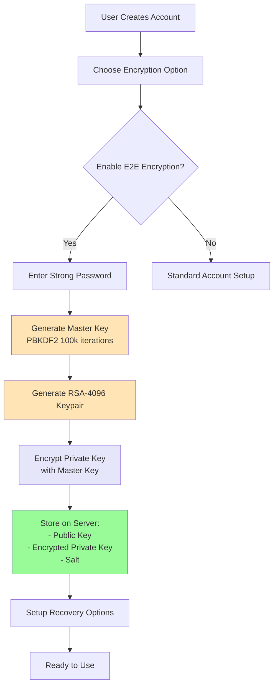
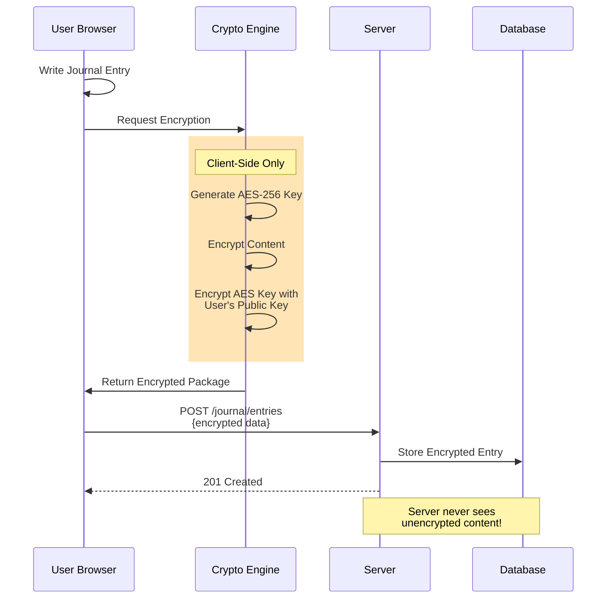
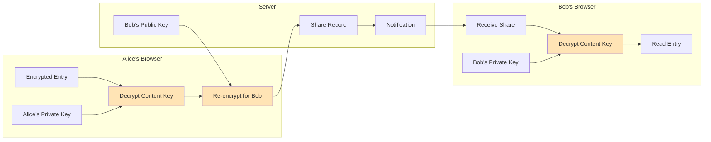
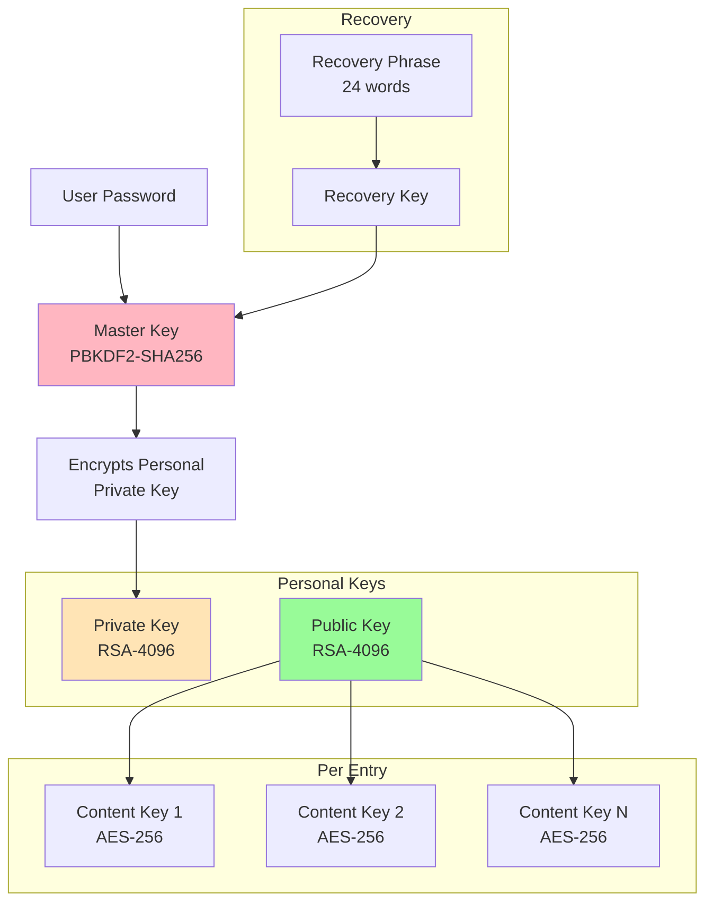
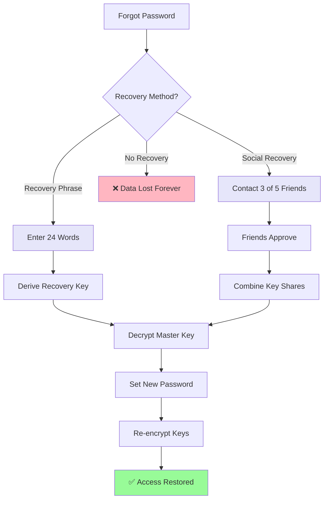
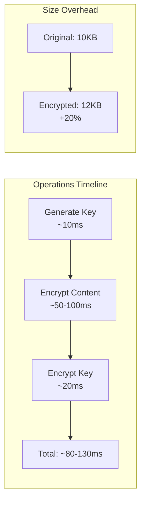
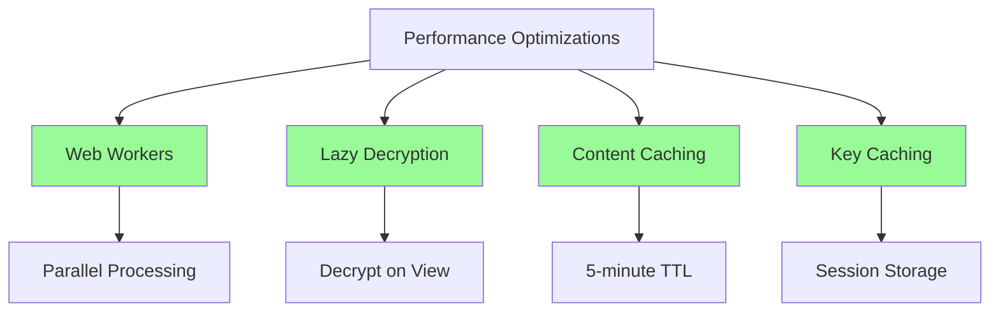
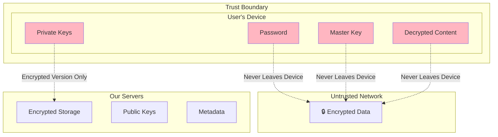
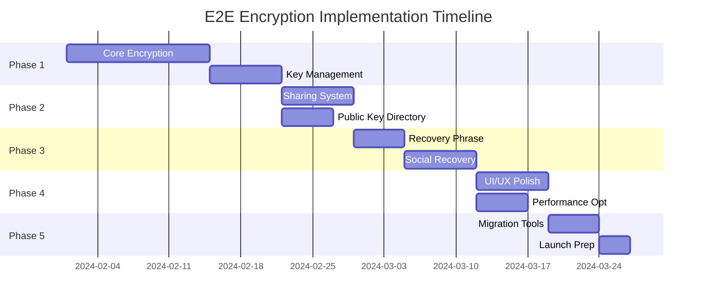

# End-to-End Encryption - Visual Architecture

## Encryption Flow Diagrams

### 1. Initial Setup Flow



### 2. Creating Encrypted Entry



### 3. Sharing Encrypted Entry



### 4. Key Hierarchy



### 5. Recovery Options Flow



## Data Flow Visualization

### What the Server Sees

```
┌─────────────────────────────────────┐
│ What Server Stores:                 │
│                                     │
│ entryId: "entry-123"               │
│ userId: "user-456"                 │
│ encryptedContent: "7J+U3K8dS9..."  │ ← Gibberish
│ encryptedKey: "mK9dj3Hs8..."      │ ← Gibberish
│ iv: "8dK3js9..."                   │
│ metadata: {                        │
│   wordCount: 523,                  │ ← Visible
│   created: "2024-01-15",           │ ← Visible
│   isEncrypted: true                │ ← Visible
│ }                                  │
└─────────────────────────────────────┘

❌ Cannot see: Content, Title, Tags (if encrypted)
✅ Can see: Metadata, Dates, Structure
```

### What the User Sees

```
┌─────────────────────────────────────┐
│ After Decryption in Browser:       │
│                                     │
│ Title: "Today's Reflection"        │
│                                     │
│ Content:                           │
│ "Today was challenging but I       │
│  learned so much about myself..."  │
│                                     │
│ Tags: #personal #growth #therapy   │
│ Mood: Thoughtful                   │
│                                     │
│ [🔒 End-to-End Encrypted]          │
└─────────────────────────────────────┘
```

## Performance Characteristics

### Encryption Overhead



### Optimization Strategies



## Security Boundaries



## Implementation Phases



This visual guide helps understand the complete encryption system architecture and flow!