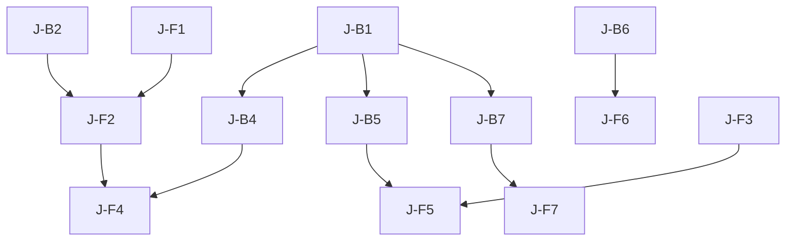

# Journaling Feature - Sprint Plan

## Sprint Overview
**Duration**: 3 Sprints (6 weeks)
**Goal**: Deliver a fully functional journaling module with AI integration

## Sprint 1: Core Journaling (Week 1-2)

### Backend Tasks

#### Task J-B1: Journal Entry CRUD Operations
**Priority**: P1
**Estimate**: 10 hours
**Description**: Implement create, read, update, delete operations for journal entries

**Deliverables**:
- Lambda function for journal entry operations
- DynamoDB table with proper indexes
- Input validation and error handling
- Unit tests with >80% coverage

**Technical Requirements**:
- Single table design with GSIs for access patterns
- Soft delete with 30-day recovery
- Pagination support
- Full-text search preparation

#### Task J-B2: Media Upload Support
**Priority**: P2
**Estimate**: 6 hours
**Description**: Handle image and audio uploads for journal entries

**Deliverables**:
- S3 bucket configuration with lifecycle rules
- Presigned URL generation for uploads
- Image thumbnail generation
- Audio file validation

#### Task J-B3: Privacy & Security Layer
**Priority**: P1
**Estimate**: 8 hours
**Description**: Implement privacy controls and optional encryption

**Deliverables**:
- Access control for private/shared entries
- Optional client-side encryption support
- Secure sharing mechanism
- Audit logging

### Frontend Tasks

#### Task J-F1: TipTap Editor Integration
**Priority**: P1
**Estimate**: 12 hours
**Description**: Integrate and customize TipTap editor for journaling

**Deliverables**:
- TipTap setup with custom extensions
- Markdown import/export
- Auto-save functionality
- Character/word counting
- Custom toolbar

**Technical Requirements**:
- Support for all basic formatting
- Keyboard shortcuts
- Mobile-responsive design
- Accessibility compliance

#### Task J-F2: Entry Management UI
**Priority**: P1
**Estimate**: 10 hours
**Description**: Create UI for listing, viewing, and managing entries

**Deliverables**:
- Entry list with filtering/search
- Entry detail view
- Edit/delete functionality
- Tag management
- Mood selector

#### Task J-F3: State Management & API Integration
**Priority**: P1
**Estimate**: 8 hours
**Description**: Set up Zustand store and API client for journaling

**Deliverables**:
- Zustand store for journal state
- API client with proper error handling
- Optimistic updates
- Offline support foundation

## Sprint 2: AI & Goals (Week 3-4)

### Backend Tasks

#### Task J-B4: AI Integration Service
**Priority**: P1
**Estimate**: 12 hours
**Description**: Integrate AWS Bedrock and Comprehend for AI features

**Deliverables**:
- AI service Lambda function
- Prompt generation endpoint
- Sentiment analysis endpoint
- Theme extraction logic
- Rate limiting

#### Task J-B5: Journaling Goals System
**Priority**: P1
**Estimate**: 10 hours
**Description**: Implement goal creation and tracking

**Deliverables**:
- Goals CRUD operations
- Scheduling system (cron-like)
- Streak calculation
- Progress tracking
- Reminder queue setup

#### Task J-B6: Analytics Engine
**Priority**: P2
**Estimate**: 8 hours
**Description**: Build analytics and insights generation

**Deliverables**:
- Statistics aggregation
- Trend analysis
- Export functionality
- Performance optimization

### Frontend Tasks

#### Task J-F4: AI Assistant UI
**Priority**: P1
**Estimate**: 10 hours
**Description**: Create AI-powered features UI

**Deliverables**:
- AI prompt suggestion panel
- Inline AI assistance
- Sentiment visualization
- Theme tags display
- Loading states for AI operations

#### Task J-F5: Goals Management UI
**Priority**: P1
**Estimate**: 12 hours
**Description**: Build goal creation and tracking interface

**Deliverables**:
- Goal creation wizard
- Schedule picker
- Streak visualization
- Progress indicators
- Reminder preferences

#### Task J-F6: Analytics Dashboard
**Priority**: P2
**Estimate**: 8 hours
**Description**: Create insights and statistics view

**Deliverables**:
- Statistics cards
- Mood trend chart
- Theme word cloud
- Writing habits visualization
- Export functionality

## Sprint 3: Social & Polish (Week 5-6)

### Backend Tasks

#### Task J-B7: Social Features API
**Priority**: P2
**Estimate**: 10 hours
**Description**: Implement sharing, comments, and reactions

**Deliverables**:
- Sharing mechanism with privacy
- Comments CRUD
- Reactions system
- Feed generation
- Moderation hooks

#### Task J-B8: Performance Optimization
**Priority**: P1
**Estimate**: 8 hours
**Description**: Optimize for scale and performance

**Deliverables**:
- Caching layer (ElastiCache)
- Query optimization
- Batch operations
- CloudWatch metrics
- Load testing

#### Task J-B9: Email & Notifications
**Priority**: P2
**Estimate**: 6 hours
**Description**: Set up reminder and notification system

**Deliverables**:
- SES email templates
- Reminder scheduling
- Notification preferences
- Unsubscribe mechanism

### Frontend Tasks

#### Task J-F7: Social Features UI
**Priority**: P2
**Estimate**: 10 hours
**Description**: Build sharing and community features

**Deliverables**:
- Share dialog with privacy options
- Public feed view
- Comment threads
- Reaction buttons
- User profiles for journals

#### Task J-F8: Mobile Optimization
**Priority**: P1
**Estimate**: 8 hours
**Description**: Ensure excellent mobile experience

**Deliverables**:
- Responsive editor
- Touch-optimized UI
- Offline capability
- Performance optimization
- PWA features

#### Task J-F9: Polish & Testing
**Priority**: P1
**Estimate**: 10 hours
**Description**: Final polish and comprehensive testing

**Deliverables**:
- Loading states
- Error boundaries
- Empty states
- Animations
- E2E tests
- Accessibility audit

## Task Dependencies

## Definition of Done

### Backend Tasks
- [ ] Code complete with error handling
- [ ] Unit tests >80% coverage
- [ ] Integration tests for happy path
- [ ] API documentation updated
- [ ] Performance metrics added
- [ ] Security review completed
- [ ] Deployed to dev environment

### Frontend Tasks
- [ ] Component complete with props/types
- [ ] Unit tests for logic
- [ ] Storybook story created
- [ ] Responsive design verified
- [ ] Accessibility tested
- [ ] Loading/error states handled
- [ ] Integrated with real API

## Risk Mitigation

### Technical Risks
1. **TipTap Complexity**: Allocate extra time for editor customization
2. **AI Rate Limits**: Implement caching and queuing
3. **DynamoDB Hot Partitions**: Design proper key distribution
4. **Large Entry Storage**: Implement compression for old entries

### Schedule Risks
1. **Sprint 1 Overrun**: Social features can be moved to v2
2. **AI Integration Delays**: Have fallback to basic prompts
3. **Frontend Complexity**: Consider using more TipTap defaults

## Success Metrics

### Sprint 1
- [ ] Users can create, edit, delete journal entries
- [ ] Basic editor working on mobile and desktop
- [ ] Entries are properly secured

### Sprint 2
- [ ] AI prompts generating relevant suggestions
- [ ] Goals created and tracked successfully
- [ ] Analytics showing meaningful insights

### Sprint 3
- [ ] Sharing working with proper privacy
- [ ] Performance <200ms for common operations
- [ ] Mobile experience polished

## Communication Plan

### Daily Standups
- Backend and Frontend sync on integration points
- Blocker identification and resolution
- Progress updates against sprint goals

### Weekly Demos
- Friday demos of completed features
- Stakeholder feedback collection
- Adjustment planning for next week

### Integration Points
- API contract reviews before implementation
- Joint testing sessions
- Shared documentation updates

## Resource Allocation

### Sprint 1
- Backend: 24 hours (3 days)
- Frontend: 30 hours (4 days)
- Testing: 8 hours (1 day)

### Sprint 2
- Backend: 30 hours (4 days)
- Frontend: 30 hours (4 days)
- Testing: 8 hours (1 day)

### Sprint 3
- Backend: 24 hours (3 days)
- Frontend: 28 hours (3.5 days)
- Testing: 12 hours (1.5 days)

**Total**: 194 hours (~4.9 weeks of work)
