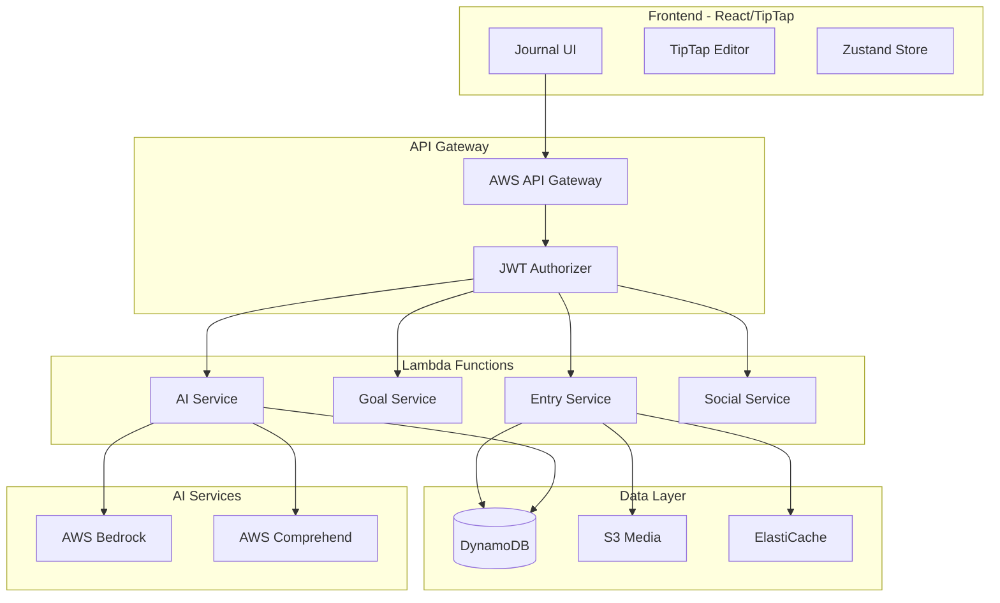

# Journaling Feature - Technical Architecture

## System Architecture



## Frontend Architecture

### Technology Stack
- **Editor**: TipTap v2 with custom extensions
- **State Management**: Zustand for journal state
- **UI Framework**: React 18 with TypeScript
- **Styling**: Tailwind CSS with custom theme
- **Data Fetching**: TanStack Query v5

### Component Structure
```
frontend/src/features/journaling/
├── components/
│   ├── JournalEditor/
│   │   ├── Editor.tsx           # TipTap wrapper
│   │   ├── MenuBar.tsx          # Formatting toolbar
│   │   ├── AiAssistant.tsx      # AI suggestions panel
│   │   └── MediaUpload.tsx      # Image/audio handling
│   ├── EntryList/
│   │   ├── EntryCard.tsx        # Entry preview
│   │   ├── FilterBar.tsx        # Search/filter UI
│   │   └── EntryGrid.tsx        # Responsive grid
│   ├── Goals/
│   │   ├── GoalCard.tsx         # Goal progress
│   │   ├── GoalCreator.tsx      # New goal form
│   │   └── StreakTracker.tsx    # Visual streak
│   └── Social/
│       ├── SharedFeed.tsx       # Public entries
│       ├── Comments.tsx         # Comment thread
│       └── Reactions.tsx        # Reaction buttons
├── hooks/
│   ├── useJournal.ts            # Entry CRUD operations
│   ├── useAiAssistant.ts        # AI integration
│   └── useAutoSave.ts           # Draft persistence
├── store/
│   ├── journalStore.ts          # Zustand store
│   └── editorStore.ts           # Editor state
└── utils/
    ├── encryption.ts            # Client-side encryption
    └── export.ts                # Export utilities
```

### TipTap Configuration
```typescript
// Editor setup with custom extensions
import { useEditor } from '@tiptap/react'
import StarterKit from '@tiptap/starter-kit'
import Markdown from '@tiptap/extension-markdown'
import Placeholder from '@tiptap/extension-placeholder'
import CharacterCount from '@tiptap/extension-character-count'
import { AiSuggestion } from './extensions/AiSuggestion'
import { MoodTracker } from './extensions/MoodTracker'
import { JournalPrompt } from './extensions/JournalPrompt'

const editor = useEditor({
  extensions: [
    StarterKit,
    Markdown,
    Placeholder.configure({
      placeholder: 'Start writing your thoughts...'
    }),
    CharacterCount.configure({
      limit: 10000  // ~2000 words
    }),
    AiSuggestion,   // Custom AI integration
    MoodTracker,    // Inline mood selection
    JournalPrompt   // Prompt integration
  ],
  autofocus: true,
  editable: true,
  onUpdate: ({ editor }) => {
    // Auto-save logic
    debouncedSave(editor.getJSON())
  }
})
```

## Backend Architecture

### Lambda Functions

#### 1. Entry Service Lambda
```python
# backend/src/journal_entry/handler.py
from aws_lambda_powertools import Logger, Tracer, Metrics
from aws_lambda_powertools.metrics import MetricUnit

logger = Logger()
tracer = Tracer()
metrics = Metrics()

@logger.inject_lambda_context
@tracer.capture_lambda_handler
@metrics.log_metrics
def lambda_handler(event, context):
    # Route handling
    path = event['path']
    method = event['httpMethod']
    
    if path == '/journal/entries' and method == 'POST':
        return create_entry(event)
    elif path.startswith('/journal/entries/') and method == 'GET':
        return get_entry(event)
    # ... more routes
```

#### 2. AI Service Lambda
```python
# backend/src/journal_ai/service.py
import boto3
from langchain.llms.bedrock import Bedrock
from langchain.chains import LLMChain
from langchain.prompts import PromptTemplate

class JournalAiService:
    def __init__(self):
        self.bedrock = boto3.client('bedrock-runtime')
        self.comprehend = boto3.client('comprehend')
        self.llm = Bedrock(
            model_id="anthropic.claude-v2",
            client=self.bedrock
        )
    
    async def generate_prompt(self, context: dict) -> dict:
        template = """
        Generate a thoughtful journaling prompt for someone who:
        - Recent themes: {recent_themes}
        - Current mood: {mood}
        - Time of day: {time_of_day}
        
        Create a prompt that encourages deep reflection and growth.
        """
        
        prompt = PromptTemplate(
            template=template,
            input_variables=["recent_themes", "mood", "time_of_day"]
        )
        
        chain = LLMChain(llm=self.llm, prompt=prompt)
        result = await chain.arun(**context)
        
        return self._parse_prompt_response(result)
    
    async def analyze_entry(self, content: str) -> dict:
        # Sentiment analysis
        sentiment = self.comprehend.detect_sentiment(
            Text=content,
            LanguageCode='en'
        )
        
        # Key phrase extraction
        phrases = self.comprehend.detect_key_phrases(
            Text=content,
            LanguageCode='en'
        )
        
        # AI insights
        insights = await self._generate_insights(content, sentiment, phrases)
        
        return {
            'sentiment': sentiment['Sentiment'],
            'themes': [p['Text'] for p in phrases['KeyPhrases']],
            'suggestions': insights
        }
```

### Data Access Patterns

#### 1. Single Table Design
```python
# backend/src/journal_entry/repository.py
class JournalRepository:
    def __init__(self, table_name: str):
        self.table = boto3.resource('dynamodb').Table(table_name)
    
    def create_entry(self, user_id: str, entry_data: dict) -> dict:
        item = {
            'pk': f'USER#{user_id}',
            'sk': f'ENTRY#{entry_data["entryId"]}',
            'type': 'JournalEntry',
            'gsi1pk': f'ENTRY#{entry_data["entryId"]}',
            'gsi1sk': entry_data['createdAt'],
            **entry_data
        }
        
        if entry_data.get('visibility') == 'shared':
            item['gsi2pk'] = 'SHARED'
            item['gsi2sk'] = entry_data['createdAt']
        
        self.table.put_item(Item=item)
        return item
    
    def get_user_entries(self, user_id: str, limit: int = 20) -> list:
        response = self.table.query(
            KeyConditionExpression=Key('pk').eq(f'USER#{user_id}') & 
                                 Key('sk').begins_with('ENTRY#'),
            ScanIndexForward=False,  # Newest first
            Limit=limit
        )
        return response['Items']
```

## Security Architecture

### 1. Encryption Strategy
```typescript
// Client-side encryption for sensitive entries
import { encrypt, decrypt } from '@aws-crypto/client-browser'

class JournalEncryption {
  private keyring: KmsKeyringBrowser
  
  constructor() {
    this.keyring = new KmsKeyringBrowser({
      clientProvider: getClient,
      generatorKeyId: process.env.REACT_APP_KMS_KEY_ID,
      keyIds: [process.env.REACT_APP_KMS_KEY_ID]
    })
  }
  
  async encryptEntry(content: string): Promise<string> {
    const { result } = await encrypt(this.keyring, content, {
      encryptionContext: {
        purpose: 'journal.entry',
        userId: getCurrentUserId()
      }
    })
    return result.toString('base64')
  }
}
```

### 2. Access Control
```python
# Fine-grained permissions
def check_entry_access(user_id: str, entry: dict) -> bool:
    # Owner always has access
    if entry['userId'] == user_id:
        return True
    
    # Check visibility rules
    if entry['visibility'] == 'private':
        return False
    elif entry['visibility'] == 'friends':
        return is_friend(user_id, entry['userId'])
    elif entry['visibility'] == 'shared':
        return True
    
    return False
```

## Performance Optimization

### 1. Caching Strategy
```python
# ElastiCache for frequently accessed data
class CacheService:
    def __init__(self):
        self.redis = redis.Redis(
            host=os.environ['REDIS_HOST'],
            decode_responses=True
        )
    
    def cache_entry(self, entry_id: str, entry_data: dict):
        key = f'entry:{entry_id}'
        self.redis.setex(
            key,
            3600,  # 1 hour TTL
            json.dumps(entry_data)
        )
    
    def get_cached_entry(self, entry_id: str) -> dict:
        data = self.redis.get(f'entry:{entry_id}')
        return json.loads(data) if data else None
```

### 2. Pagination & Infinite Scroll
```typescript
// React Query infinite scroll implementation
const useInfiniteEntries = () => {
  return useInfiniteQuery({
    queryKey: ['entries'],
    queryFn: ({ pageParam = 1 }) => 
      fetchEntries({ page: pageParam, limit: 20 }),
    getNextPageParam: (lastPage) => 
      lastPage.hasMore ? lastPage.nextPage : undefined,
    staleTime: 5 * 60 * 1000, // 5 minutes
  })
}
```

## Monitoring & Observability

### 1. CloudWatch Metrics
```python
# Custom metrics for journal usage
@metrics.log_metrics(capture_cold_start_metric=True)
def create_entry_handler(event, context):
    metrics.add_metric(name="EntryCreated", unit=MetricUnit.Count, value=1)
    metrics.add_metadata(key="entryLength", value=len(content))
    metrics.add_metadata(key="hasAiInsights", value=bool(ai_insights))
```

### 2. Distributed Tracing
```python
@tracer.capture_method
def analyze_entry_with_ai(content: str):
    tracer.put_annotation(key="contentLength", value=len(content))
    tracer.put_metadata(key="aiModel", value="claude-v2")
    
    # AI processing...
    
    tracer.put_metric(key="aiProcessingTime", value=processing_time)
```

## Cost Optimization

### 1. Smart AI Usage
- Cache AI-generated prompts for reuse
- Batch sentiment analysis for multiple entries
- Use lighter models for simple tasks
- Implement user quotas for AI features

### 2. Storage Optimization
- Compress old entries (>6 months)
- Archive to S3 Glacier for entries >1 year
- Implement automatic cleanup for deleted entries
- Use S3 lifecycle policies for media

### 3. Read/Write Optimization
- Batch write operations where possible
- Use projection expressions in queries
- Implement connection pooling
- Cache frequently accessed data

## Deployment Strategy

### 1. Infrastructure as Code
```yaml
# serverless.yml excerpt
functions:
  journalEntry:
    handler: src/journal_entry/handler.lambda_handler
    events:
      - http:
          path: /journal/entries
          method: ANY
          authorizer: aws_iam
    environment:
      TABLE_NAME: ${self:custom.tableName}
      BUCKET_NAME: ${self:custom.bucketName}
    layers:
      - ${self:custom.powerToolsLayer}
```

### 2. CI/CD Pipeline
```yaml
# GitHub Actions workflow
name: Deploy Journal Feature
on:
  push:
    branches: [main]
    paths:
      - 'backend/src/journal_*/**'
      - 'frontend/src/features/journaling/**'

jobs:
  deploy-backend:
    runs-on: ubuntu-latest
    steps:
      - uses: actions/checkout@v3
      - name: Deploy Lambda Functions
        run: |
          cd backend
          npm run deploy:journal
  
  deploy-frontend:
    runs-on: ubuntu-latest
    steps:
      - uses: actions/checkout@v3
      - name: Build and Deploy
        run: |
          cd frontend
          npm run build
          aws s3 sync dist/ s3://$BUCKET_NAME
          aws cloudfront create-invalidation --distribution-id $DIST_ID --paths "/*"
```

## Testing Strategy

### 1. Unit Tests
```python
# Test AI service
def test_generate_prompt():
    service = JournalAiService()
    context = {
        'recent_themes': ['gratitude', 'growth'],
        'mood': 'positive',
        'time_of_day': 'morning'
    }
    
    prompt = service.generate_prompt(context)
    
    assert prompt['questions']
    assert len(prompt['questions']) > 0
    assert 'gratitude' in prompt['questions'][0]['text'].lower()
```

### 2. Integration Tests
```typescript
// Test journal creation flow
describe('Journal Creation', () => {
  it('should create entry with AI insights', async () => {
    const entry = await createJournalEntry({
      title: 'Test Entry',
      content: 'Today was a great day...',
      requestAiInsights: true
    })
    
    expect(entry.aiInsights).toBeDefined()
    expect(entry.aiInsights.sentiment).toBeGreaterThan(0)
  })
})
```

### 3. E2E Tests
```typescript
// Cypress test for complete journal flow
describe('Journal User Flow', () => {
  it('completes daily journal goal', () => {
    cy.login()
    cy.visit('/journal')
    cy.findByText('Daily Gratitude').click()
    cy.findByRole('textbox').type('I am grateful for...')
    cy.findByText('Save Entry').click()
    cy.findByText('Goal completed!').should('exist')
  })
})
```
