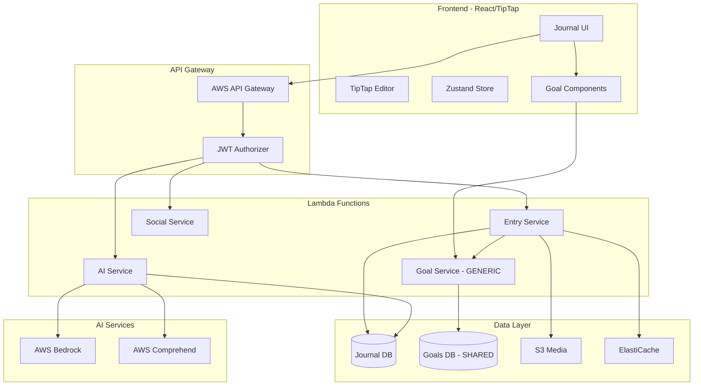
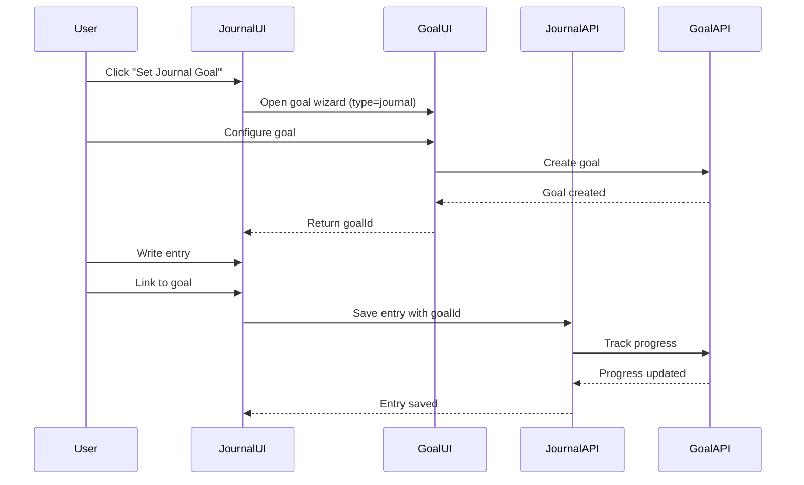

# Journaling Feature - Technical Architecture

## ⚠️ IMPORTANT: Goal System Update
**Note**: This document has been updated to reflect that journaling will use the [Generic Goal System](../core/goal-system-design-v2.md) rather than implementing its own goal tracking.

## System Architecture



## Frontend Architecture

### Technology Stack
- **Editor**: TipTap v2 with custom extensions
- **State Management**: Zustand for journal state
- **Goal Integration**: Uses generic goal components
- **UI Framework**: React 18 with TypeScript
- **Styling**: Tailwind CSS with custom theme
- **Data Fetching**: TanStack Query v5

### Component Structure
```
frontend/src/features/journaling/
├── components/
│   ├── JournalEditor/
│   │   ├── Editor.tsx           # TipTap wrapper
│   │   ├── MenuBar.tsx          # Formatting toolbar
│   │   ├── AiAssistant.tsx      # AI suggestions panel
│   │   └── MediaUpload.tsx      # Image/audio handling
│   ├── EntryList/
│   │   ├── EntryCard.tsx        # Entry preview
│   │   ├── FilterBar.tsx        # Search/filter UI
│   │   └── EntryGrid.tsx        # Responsive grid
│   └── Social/
│       ├── SharedFeed.tsx       # Public entries
│       ├── Comments.tsx         # Comment thread
│       └── Reactions.tsx        # Reaction buttons
├── hooks/
│   ├── useJournal.ts            # Entry CRUD operations
│   ├── useAiAssistant.ts        # AI integration
│   └── useAutoSave.ts           # Draft persistence
├── store/
│   ├── journalStore.ts          # Journal-specific state
│   └── editorStore.ts           # Editor state
└── utils/
    ├── encryption.ts            # Client-side encryption
    └── export.ts                # Export utilities
```

### Goal Integration Pattern
```typescript
// Instead of building journal-specific goals, we use the generic system
import { useGoals, GoalSelector } from '@/features/goals';

const JournalGoalSection = () => {
  const { goals } = useGoals({ type: 'journal' });
  const [selectedGoal, setSelectedGoal] = useState<string>();
  
  return (
    <div>
      <GoalSelector
        goals={goals}
        value={selectedGoal}
        onChange={setSelectedGoal}
        placeholder="Link to a journal goal"
      />
      {selectedGoal && (
        <GoalProgress goalId={selectedGoal} compact />
      )}
    </div>
  );
};
```

### TipTap Configuration
```typescript
// Editor setup with custom extensions
import { useEditor } from '@tiptap/react'
import StarterKit from '@tiptap/starter-kit'
import Markdown from '@tiptap/extension-markdown'
import Placeholder from '@tiptap/extension-placeholder'
import CharacterCount from '@tiptap/extension-character-count'
import { AiSuggestion } from './extensions/AiSuggestion'
import { MoodTracker } from './extensions/MoodTracker'
import { GoalLink } from './extensions/GoalLink'  // Links to generic goals

const editor = useEditor({
  extensions: [
    StarterKit,
    Markdown,
    Placeholder.configure({
      placeholder: 'Start writing your thoughts...'
    }),
    CharacterCount.configure({
      limit: 10000  // ~2000 words
    }),
    AiSuggestion,   // Custom AI integration
    MoodTracker,    // Inline mood selection
    GoalLink        // Link entries to goals
  ],
  autofocus: true,
  editable: true,
  onUpdate: ({ editor }) => {
    // Auto-save logic
    debouncedSave(editor.getJSON())
    
    // Update goal progress if linked
    if (linkedGoalId) {
      checkGoalProgress(linkedGoalId);
    }
  }
})
```

## Backend Architecture

### Lambda Functions

#### 1. Entry Service Lambda
Handles journal entry CRUD operations and integrates with goal tracking.

```python
# backend/src/journal_entry/handler.py
from aws_lambda_powertools import Logger, Tracer, Metrics
from aws_lambda_powertools.metrics import MetricUnit
import boto3

logger = Logger()
tracer = Tracer()
metrics = Metrics()

# Initialize clients
goal_service = boto3.client('lambda')
dynamodb = boto3.resource('dynamodb')

@logger.inject_lambda_context
@tracer.capture_lambda_handler
@metrics.log_metrics
def lambda_handler(event, context):
    # Route handling
    path = event['path']
    method = event['httpMethod']
    
    if path == '/journal/entries' and method == 'POST':
        return create_entry(event)
    elif path.startswith('/journal/entries/') and method == 'GET':
        return get_entry(event)
    # ... more routes

async def create_entry(event):
    # Create journal entry
    entry = create_journal_entry(event['body'])
    
    # If linked to a goal, update progress
    if entry.get('goalId'):
        await update_goal_progress(
            goal_id=entry['goalId'],
            activity={
                'value': 1,
                'unit': 'entry',
                'context': {
                    'entryId': entry['entryId'],
                    'wordCount': entry['wordCount'],
                    'mood': entry['mood']
                }
            }
        )
    
    return entry

async def update_goal_progress(goal_id, activity):
    """Call generic goal service to track progress"""
    goal_service.invoke(
        FunctionName='goal-service',
        InvocationType='Event',
        Payload=json.dumps({
            'action': 'track',
            'goalId': goal_id,
            'activity': activity
        })
    )
```

#### 2. AI Service Lambda
```python
# backend/src/journal_ai/service.py
import boto3
from langchain.llms.bedrock import Bedrock
from langchain.chains import LLMChain
from langchain.prompts import PromptTemplate

class JournalAiService:
    def __init__(self):
        self.bedrock = boto3.client('bedrock-runtime')
        self.comprehend = boto3.client('comprehend')
        self.goal_service = boto3.client('lambda')
        self.llm = Bedrock(
            model_id="anthropic.claude-v2",
            client=self.bedrock
        )
    
    async def generate_prompt(self, context: dict) -> dict:
        # Get user's journal goals for context
        goals = await self.get_user_journal_goals(context['userId'])
        
        template = """
        Generate a thoughtful journaling prompt for someone who:
        - Recent themes: {recent_themes}
        - Current mood: {mood}
        - Time of day: {time_of_day}
        - Active goals: {goals}
        
        Create a prompt that encourages deep reflection and goal progress.
        """
        
        prompt = PromptTemplate(
            template=template,
            input_variables=["recent_themes", "mood", "time_of_day", "goals"]
        )
        
        chain = LLMChain(llm=self.llm, prompt=prompt)
        result = await chain.arun(
            recent_themes=context['recent_themes'],
            mood=context['mood'],
            time_of_day=context['time_of_day'],
            goals=[g['title'] for g in goals]
        )
        
        return self._parse_prompt_response(result)
    
    async def get_user_journal_goals(self, user_id):
        """Fetch journal goals from generic goal service"""
        response = goal_service.invoke(
            FunctionName='goal-service',
            InvocationType='RequestResponse',
            Payload=json.dumps({
                'action': 'list',
                'userId': user_id,
                'filters': {'type': 'journal', 'status': 'active'}
            })
        )
        return json.loads(response['Payload'])['goals']
```

### Data Access Patterns

#### Journal Entries Table
```python
# backend/src/journal_entry/repository.py
class JournalRepository:
    def __init__(self, table_name: str):
        self.table = boto3.resource('dynamodb').Table(table_name)
        self.goal_client = GoalServiceClient()  # Generic goal service
    
    def create_entry(self, user_id: str, entry_data: dict) -> dict:
        item = {
            'pk': f'USER#{user_id}',
            'sk': f'ENTRY#{entry_data["entryId"]}',
            'type': 'JournalEntry',
            'gsi1pk': f'ENTRY#{entry_data["entryId"]}',
            'gsi1sk': entry_data['createdAt'],
            **entry_data
        }
        
        if entry_data.get('visibility') == 'shared':
            item['gsi2pk'] = 'SHARED'
            item['gsi2sk'] = entry_data['createdAt']
        
        self.table.put_item(Item=item)
        
        # Update goal progress if linked
        if entry_data.get('goalId'):
            self.goal_client.track_activity(
                goal_id=entry_data['goalId'],
                value=1,
                context={'entryId': entry_data['entryId']}
            )
        
        return item
```

## Goal System Integration

### How Journaling Uses Generic Goals

1. **Goal Creation**: Users create journal goals through the generic goal UI
2. **Progress Tracking**: Automatic when entries are linked to goals
3. **Reminders**: Handled by generic reminder system
4. **Analytics**: Combined with other lifestyle goals

### Example Integration Flow


## Performance Optimization

### 1. Caching Strategy
```python
# Use generic goal cache for goal data
class CacheService:
    def __init__(self):
        self.redis = redis.Redis(
            host=os.environ['REDIS_HOST'],
            decode_responses=True
        )
    
    def cache_entry(self, entry_id: str, entry_data: dict):
        key = f'entry:{entry_id}'
        self.redis.setex(
            key,
            3600,  # 1 hour TTL
            json.dumps(entry_data)
        )
    
    def get_user_goals(self, user_id: str) -> list:
        # Leverage generic goal cache
        return self.goal_cache.get_user_goals(user_id, type='journal')
```

### 2. Optimized Queries
- Journal entries use dedicated table
- Goal data fetched from generic goal service
- Minimize cross-service calls with caching
- Batch operations where possible

## Monitoring & Observability

### 1. CloudWatch Metrics
```python
# Journal-specific metrics
@metrics.log_metrics(capture_cold_start_metric=True)
def create_entry_handler(event, context):
    metrics.add_metric(name="EntryCreated", unit=MetricUnit.Count, value=1)
    metrics.add_metadata(key="entryLength", value=len(content))
    metrics.add_metadata(key="hasGoal", value=bool(goal_id))
    metrics.add_metadata(key="hasAiInsights", value=bool(ai_insights))
```

### 2. Cross-Service Tracing
```python
@tracer.capture_method
def track_journal_goal(entry_id: str, goal_id: str):
    tracer.put_annotation(key="entryId", value=entry_id)
    tracer.put_annotation(key="goalId", value=goal_id)
    tracer.put_metadata(key="service", value="journal")
    
    # Call goal service with tracing
    with tracer.provider.get_tracer().start_as_current_span("goal_tracking"):
        goal_service.track_progress(goal_id)
```

## Key Architecture Benefits

### By Using Generic Goal System
1. **No Duplicate Code**: Goal logic centralized
2. **Consistent UX**: Same goal experience everywhere
3. **Rich Analytics**: Cross-feature insights
4. **Faster Development**: ~100 hours saved
5. **Better Integration**: Native support from day 1

### Focused Development
The journaling team can focus on:
- Rich text editing experience
- AI-powered prompts and insights
- Privacy and sharing features
- Journal-specific analytics
- Social features

Without worrying about:
- Goal CRUD operations
- Progress calculations
- Streak tracking
- Reminder systems
- Goal analytics

## Deployment Strategy

### Infrastructure as Code
```yaml
# serverless.yml excerpt
functions:
  journalEntry:
    handler: src/journal_entry/handler.lambda_handler
    events:
      - http:
          path: /journal/entries
          method: ANY
          authorizer: aws_iam
    environment:
      TABLE_NAME: ${self:custom.journalTableName}
      GOAL_SERVICE_NAME: ${self:custom.goalServiceName}
      BUCKET_NAME: ${self:custom.bucketName}
    layers:
      - ${self:custom.powerToolsLayer}
```

### Service Dependencies
```yaml
# Ensure goal service is deployed first
dependsOn:
  - goalService
  - authService
```

## Summary

By leveraging the generic goal system, the journaling feature becomes:
- **Simpler**: Less code to write and maintain
- **More Powerful**: Inherits all goal system capabilities
- **Better Integrated**: Works seamlessly with other features
- **Future-Proof**: Benefits from goal system improvements

The architecture focuses on what makes journaling unique while delegating common functionality to shared services.